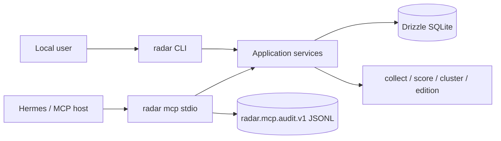

# Personal Drama Radar CLI / MCP / Hermes 接口

状态：M1–M4 已实现（代码真源 `src/cli.ts`、`src/app/actions.ts`、`src/mcp/`；canary 4.2/5.2–5.4 为外部时间门）。实施真源为 [`personalized-radar-agent-experience-v1`](../../openspec/changes/archive/2026-09-03-personalized-radar-agent-experience-v1/)；四层采集与 `short-drama-radar.card.v1` 仍由 [`establish-crawler-first-radar`](../../openspec/changes/archive/2026-09-03-establish-crawler-first-radar/) 跟踪。

## 1. 接口原则

1. CLI 是主操作面；MCP 是同一 application service 的 Agent 投影，不执行 CLI shell fallback。
2. Profile、反馈、机会、Edition、run 与审计只有 Radar 一份真源。
3. MCP 保持两个工具、三条 lane；Profile mutation 永远只走 CLI。
4. planned/blocked/unavailable 只在 capabilities 中披露，不进入工具 discovery。
5. 断线后先 lookup/reconcile，不自动重复 collect、daily run 或 feedback。
6. `short-drama-radar.card.v1` 保持不变；个人化使用独立 additive schemas。



## 2. CLI 命令面

### 2.1 Profile 与反馈

```bash
radar profile create --name personal
radar profile show
radar profile show --profile <profile-ref>
radar profile set --profile <profile-ref> --topics sweet-romance,identity-reversal
radar profile activate <profile-ref>
radar feedback add --opportunity <opportunity-ref> --kind saved
radar feedback add --opportunity <opportunity-ref> --kind used --project-ref <opaque-project-ref>
radar opportunity review --opportunity <opportunity-ref> --decision needs_evidence
```

Profile 更新产生新 revision。反馈 kind 固定为：

```text
saved | dismissed | used | not_relevant | too_risky | already_seen
```

### 2.2 Pipeline 与 Edition

```bash
radar collect
radar score [date]
radar cluster build [date]
radar card [date]
radar edition build [date] --profile <profile-ref> --limit 8
radar edition show latest
radar edition show <edition-ref>
radar canary report 14 --profile <profile-ref> --json
radar run
radar runs
radar doctor
```

`radar run` 的目标顺序：

```text
collect -> score -> cluster -> card + edition
```

如果没有 active profile，通用 card 仍可生成；个人 Edition 返回 `profile_required`，不得偷偷使用默认偏好。

### 2.3 MCP 与审计

```bash
radar mcp --transport stdio --lane reader
radar mcp --transport stdio --lane curator
radar mcp --transport stdio --lane operator
radar mcp doctor
radar mcp capabilities --json
radar audit tail --limit 20
```

V1 只实现 stdio。`--endpoint`、HTTP remote 与 A2A 显示 unavailable，不接受伪参数占位成功。

## 3. CLI 输出合同

### 3.1 默认 summary

默认输出面向人，使用英文短摘要，只显示状态、关键事实和一个主要 next command。

```text
Personal edition ready
edition: edition-2026-08-29-personal-r3
entries: 5
source: degraded
next: radar edition show edition-2026-08-29-personal-r3
```

### 3.2 `--json`

`--json` stdout 只输出一个标准 envelope：

```json
{
  "spec_version": "1.0",
  "mode": "json",
  "command": "radar.edition.show",
  "status": "success",
  "summary": "Personal edition ready.",
  "facts": {
    "degraded": true
  },
  "actions": [
    {
      "name": "show_profile",
      "command": "radar profile show --profile profile-personal"
    }
  ],
  "evidence": [
    "edition-2026-08-29-personal-r3"
  ],
  "data": {}
}
```

顶层只允许：

```text
spec_version mode command status summary facts actions evidence confidence data error
```

`status` 固定为 `success|partial|failed`。`degraded` 是事实，不是顶层 status。

当前私有 `0.0.1` 的 `{ok,app,command,data,errors}` 只是未发布草案；首个公开版本前一次性迁移，不建立长期 legacy mode。`data.contract=short-drama-radar.card.v1` 的 payload 本身保持兼容。

### 3.3 `--agent`

`--agent` 每行一个单行 `key=value`：

```text
spec_version=1.0
mode=agent
command=radar.edition.show
status=success
fact.edition_ref=edition-2026-08-29-personal-r3
fact.profile_revision=3
metric.entries=5
fact.degraded=true
action.detail="radar edition show edition-2026-08-29-personal-r3 --json"
```

必填键只有 `spec_version/mode/command/status`；其余使用 `fact.*`、`metric.*`、`action.*`、`evidence.*`、`error.*`。不内嵌完整 Edition 或原始指标。

### 3.4 `--events`

`collect` 与 `run` 支持 NDJSON：

```json
{"type":"start","spec_version":"1.0","command":"radar.run","seq":1,"run_id":"run-..."}
{"type":"progress","stage":"collect","seq":2,"run_id":"run-..."}
{"type":"progress","stage":"edition","seq":6,"run_id":"run-..."}
{"type":"end","status":"partial","seq":7,"run_id":"run-..."}
```

stream 开始后失败，最后一行必须是 `error`，进程保留非零退出码。stdout 不混入诊断文本。

## 4. MCP 工具面

### 4.1 Lane

| lane | 默认用途 | 可用能力 |
| --- | --- | --- |
| `reader` | Hermes 晨报、只读 Agent | search + resources + prompt |
| `curator` | 用户确认后的偏好反馈 | reader + feedback/review |
| `operator` | 本地流水线操作 | curator + build/collect actions |

权限累积，但 consumer 还必须执行自己的更窄 allowlist。例如 Workbench 即使连接 operator，也只允许 `edition_build`，不允许浏览器调用 `collect`。

### 4.2 `radar.search`

所有 lane 可用，只读。

输入：

```text
view: opportunities | items | editions
query?: string
date?: YYYY-MM-DD
platform?: douyin | xiaohongshu
profile_ref?: string
min_market_score?: number
min_personal_fit?: number
limit?: number
```

未传 `profile_ref` 时使用 active profile。返回 compact refs、三个分数、reason codes、freshness 和 degraded；完整数据走 resource。

### 4.3 `radar.execute`

| action | lane | 说明 |
| --- | --- | --- |
| `feedback_add` | curator | append 个人反馈，要求 idempotency key |
| `opportunity_review` | curator | 接受/拒绝/需补证据的 review receipt |
| `collect` | operator | 请求外部平台/采集层，必须声明外部副作用 |
| `score` | operator | 写基础 market score |
| `cluster_build` | operator | 构建机会簇 |
| `edition_build` | operator | 构建个人 Edition |
| `daily_run` | operator | collect → score → cluster → card + edition |

`profile_create/profile_set/profile_activate` 不存在于 MCP。Agent 只能返回用户可审查的 CLI suggestion。

## 5. Resources 与 prompt

| URI | 内容 |
| --- | --- |
| `radar://profile/active` | active profile 安全摘要与 revision |
| `radar://editions/latest` | active profile 最新 Edition |
| `radar://editions/<ref>` | 指定不可变 Edition |
| `radar://opportunities/<ref>` | 机会、个人解释与 evidence refs |
| `radar://evidence/<ref>` | 脱敏来源摘要 |
| `radar://runs` | 最近运行回执 |
| `radar://sources/status` | layer health、freshness、degraded |
| `radar://capabilities` | ready/planned/blocked/unavailable + next action |

唯一 prompt：`radar_personal_brief`。

推荐顺序：

1. 读 capabilities；
2. 读 source status；
3. 读 latest Edition；
4. 输出机会、适配原因、风险和下一步。

Prompt 不授予 mutation 权限。

## 6. Audit 与恢复

每次 MCP tool call 在返回前 append `radar.mcp.audit.v1`：

```text
ts principal_ref lane tool action args_digest outcome run_ref edition_ref
```

审计不含原始参数正文、cookie、token、代理密码、provider payload、完整 prompt 或完整思维链。唯一读口是 `radar audit tail`；MCP、Workbench 和 DSH 都没有 audit resource。

恢复规则：

- feedback 使用 idempotency key；
- build/collect 返回 run/edition ref；
- timeout/断线先 lookup；
- collect/daily_run 不因 MCP 重连自动重放；
- unknown outcome 保持 unknown，不能乐观显示成功。

## 7. Hermes canary

Hermes 用户级本地 Skill 默认连接 reader lane，读取已完成 Edition。Hermes 可以生成带 opportunity/edition/profile revision/evidence refs 的非 canonical 提案大纲，但不能批准、持久化为下游 canonical project 或启动生产。Hermes cron 如被启用，只安排“读取并汇报 Edition”，不替代 Radar 的采集/构建 scheduler。

当 Edition absent、empty、stale 或 degraded 时，Hermes 输出真实原因和可运行命令。用户明确确认后可使用 curator lane写反馈，但 Profile 修改仍必须回到 CLI。

参考：

- [Hermes MCP](https://hermes-agent.nousresearch.com/docs/user-guide/features/mcp)
- [Hermes cron](https://hermes-agent.nousresearch.com/docs/user-guide/features/cron)
- [Hermes A2A](https://hermes-agent.nousresearch.com/docs/user-guide/messaging/a2a)（V1 不启用）

公共 Skill 只有在 14 天单人 canary 和 5–8 个隔离 Profile/用户验证通过后才立项。

## 8. 合同清单

| schema | 状态 | 说明 |
| --- | --- | --- |
| `short-drama-radar.card.v1` | existing / frozen | 通用榜单兼容输出 |
| `radar.personal_profile.v1` | implemented | Profile schema 与不可变 revision |
| `radar.preference_feedback.v1` | implemented | append-only、幂等、有界反馈 |
| `radar.opportunity.v1` | implemented | 市场机会簇与证据 |
| `radar.personal_opportunity.v1` | implemented | Profile-specific 排序投影 |
| `radar.morning_edition.v1` | implemented / canary | 不可变个人版次；公共发布仍受 14 天门控 |
| `radar.mcp.audit.v1` | implemented | CLI-only 审计 |
| `radar.capabilities.v1` | implemented | readiness/next action 投影 |

字段、枚举、命令或 lane 的删除/重命名必须另开兼容迁移 change。新增 optional 字段可以走 minor version；Profile/ranker/builder revision 必须随历史 Edition 一起保存。

## 9. 验证矩阵

- Profile：校验、唯一 active、revision、隔离、blocked filter。
- 排序：有界 feedback、确定回放、不同 Profile 的可解释顺序、空榜。
- 兼容：`card.v1` golden 不变，JSON envelope validators 全绿。
- CLI：summary/json/agent/events、stdout/stderr、exit code、脱敏。
- MCP：initialize/list/call/resource/prompt、lane、audit、断线 reconcile、不重放 collect。
- Hermes：ready/empty/degraded/stale/absent、reader 默认、curator 明确确认。
- Evidence：integration/component/e2e 写入 `temp/integration-test-runs/<run-id>/`。
