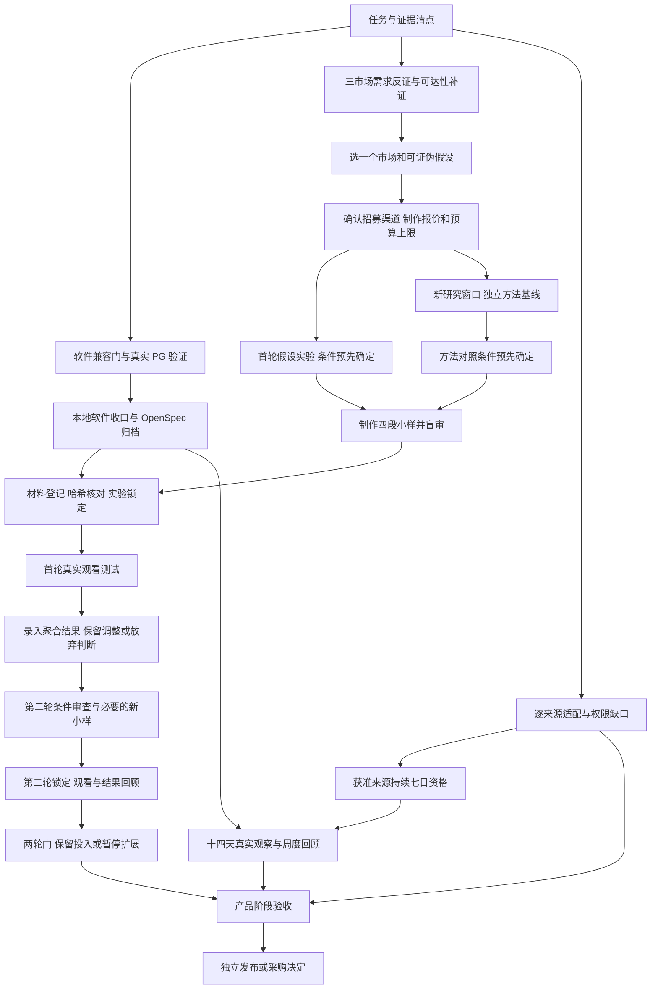

# Radar 后续交付 DAG 与 Goal

Radar 的阶段目标是帮助创作者依据证据选择市场和漫剧方向，并用真实观看结果修正判断。软件验收、来源资格、用户价值和发布是四个不同完成门。不能把任务全部勾选、一次测试成功或一个正向小样结果解释为整个项目已验证。

本文是推进设计，不是可修改的运行状态库。最新任务声明从 OpenSpec 读取，检查结果由项目脚本生成。已有研究提出 EN-A 为待验证首选、CN-B 为备选，不在本轮重新宣称市场排名。用户没有原始选题基线，首轮保持 missing；独立方法对照必须另开研究窗口。

## 依赖图

箭头表示前置交付。分叉表示可以独立推进的工作，不授权子 Agent、自动联系受众或执行生产动作。每个节点内部若需要返工，留下新修订后重新验收；图中只展开两轮实验，避免用无限循环掩盖停止条件。



H 和 N 是两种实验路径，P 每次只消费所选路径，不要求同时完成两个基线。没有独立研究者时走 H，并明确不能回答 Radar 方法是否优于基础方法。若独立路线与 Radar 路线选题相同，记录收敛，只比较研究过程，不制造观看优势。

W 保留全部已承诺来源的覆盖任务；首轮创作测试不依赖其全部完成。X/Y 只消费已获准、被明确列入当轮范围的来源。Z 必须逐项披露 W 的未接入来源，不能以单来源 canary 代替全范围交付，也不能把 blocked 当作接入成功。宏观市场研究不自动变成作品级来源资格。

## 可执行 Goal 切片

### G0：本地交付收口

目的：让项目能准确说明已经交付什么、哪些检查真正执行、下一步缺什么。

输入是现有 OpenSpec、决策模块和隔离测试。交付 DAG、只读任务清点命令、一次性本机 PostgreSQL 验证入口、修正后的实验使用文档，以及通过 strict 检查的本地软件变更。验收以类型检查、真实 PG 故障用例、全量测试证据、任务状态投影和归档回执为准。无需新增任务调度器或公共 API。

PG 归档、跨平台调度生成器、作品入库门属于软件收口候选。Linux 上的生成器测试不认证 macOS/Windows 实机安装；对应平台实测留在运行验证。红果 parser 的可选 live 重采样仍单独保留，不能为了归档而删除。

### G1：形成可投入制作的首轮实验方案

依赖 G0 的可用软件，不要求先完成全部来源接入。Radar 负责补齐三个市场的需求和反证、直接作品形式抽查、受众可达性与母语审读渠道。沿用研究方案：每市场先调查六位符合条件的成年人，直接作品至少抽查三部；这些是执行目标，不是已发生的数据。

在 E/F 验收时，必须能指出支持问题存在的具体经历、否定它的案例、可招募受众条件、制作与招募报价、用户接受的预算上限。不能靠候选简介的好评代替需求。若无可达受众或报价超出上限，回到候选选择；不扩大自动化。

交付中立的对照说明、Auctra 故事开发简报、Scaena 小样要求，以及冻结前的样本量/阈值/质量/分配条件。样本量和阈值的现有数值仅是调查起点，最终由可比性、资源和希望识别的差异共同确定，测试后不追改。

这些动作的 owner 是 split-owner：Radar 拥有问题与证据，Auctra 拥有故事，Scaena 拥有制作，受众招募由人工实验负责人执行。预算上限未知时不支付、不下单；联系方式不进入 Radar。调查公开资料可继续，联系实际人员需要具体对象及发送授权。

### G2：完成首轮观看证据闭环

依赖已确定方案和四段合格小样。操作者登记文件并核对哈希、语言、格式、时长；盲审记录制作可比性后锁定实验，再开始观察。工作包导出仅表示准备交接，不表示下游接单或实际执行。

当前材料绑定实现要求对应集时长严格相等，范围 15–600 秒。研究设计的 80–100 秒为创作目标；进入这条 CLI 路径时应剪到相同时长，不能按旧文稿的 5 秒差值直接宣称已符合软件门。首集 90% 完成、主动继续第二集至少 15 秒的定义保持不变。

验收要求：结果的分母包含已分配后未开始/退出者；fixture 与口头意愿不当作观看证据；记录实际材料摘要、测量来源和质量限制；明确每个关键判断是保留、调整还是放弃，并说明反证。没有真实观看日志时保持未完成，不填模拟计数。

### G3：完成第二轮与投入决定

依赖第一轮回顾。保持可比条件时可在同一协议下再验证；实质条件变化必须明确记录，不能把不可比结果拼成优势。两轮无优势或两轮执行无效触发暂停扩展与复盘。假设实验的结果只支持/否定该假设；只有独立方法对照才能用于比较选题方法。

验收是一份有证据的投入决定，而非必须得到正结果。停止某个假设是有效结论，不等于删除 Radar 的既有来源、晨报、关注、补看和生产交接能力。新功能仅来自重复出现的工作障碍，先复用现有 CLI/服务。

### G4：来源与日常使用验证

与 G1–G3 独立推进。保留现有来源适配任务 1.11–1.21：红果漫剧、火龙、快手、喜番、NetShort、Melolo、DramaWave、PineDrama、Kuku TV、QuickTV、B 站。每个来源分别记录作品身份、地区/语言、字段、采样范围、权限与失败原因，不把语言当地区、不把目录当需求。

进入持续七日资格前先确定具体来源和采样边界。十四天阶段至少有十天可审查产物，失败日进入分母，并有真实使用前后对照及一次周度回顾。市场 canary 报告尚未实现时继续保留 capability_unavailable，后续实现应复用已有质量记录；不能在文档中提供一个计划命令并称其能执行。

该目标不能通过修改系统时间、一次导入十四天夹具或新实验替代。跨平台调度在目标 OS 的安装/唤醒/重入验证也要使用真实运行证据，软件生成器通过只说明输出合同可用。

### G5：阶段验收与发布决定

依赖 G3 与 G4 的各自结果。验收分开回答：软件是否通过、来源哪些已具资格、选择是否获得真实行为支持、使用成本是否降低、哪些能力仍缺口、是否值得继续投资。业务实验允许得出负结论，但未执行不能写成负结论或通过。

发布、采购或部署仅在用户决定具体目标和外部影响后执行。现阶段不承诺付费、收入、预测爆款或多市场通用性，不以归档数量作为完成指标。

## 现在可以运行的命令

以下从 Radar 子项目目录运行：

```bash
bun run scripts/delivery-status.ts
bun run scripts/delivery-status.ts --json
bun run scripts/test-local-pg.ts
bun run scripts/test-local-pg.ts --all
bun run typecheck
radar decision help
```

`test-local-pg.ts` 要求本机有 initdb/pg_ctl，会建立隔离的 loopback 临时集群、写入现有集成测试证据，并清理自身创建的集群。不会使用配置中的 PG 目标。缺工具或启动失败直接失败，不静默跳过。`--all` 包含完整测试；完成一个稳定切片后运行一次即可，不反复全量扫描。

从命令返回的证据 run-id 检查记录：

```bash
bun run scripts/delivery-status.ts --evidence "$EVIDENCE_RUN_ID" --json
```

投影中的 checked/all_checked 仅是 OpenSpec 声明；closeout_candidates 需要人工对照验收证据再归档。证据只代表指定运行，不自动认证当前工作树。项目脚本保留 project_complete=false，最终业务验收由 G5 的产品回顾决定。不要用该字段充当新的产品状态真源。

## 本轮收口依据

2026-09-16，本轮类型检查通过，完整测试 362 项通过、零失败、零跳过；其中真实临时 PostgreSQL 集成 5 项通过。完整运行证据为 `temp/integration-test-runs/2026-09-16T12-47-59-800Z-ahlyvz/`。该运行只认证当次软件检查，不认证真实受众、live 来源或 macOS/Windows 实机。

跨平台调度、PG 归档、作品入库门和本次交付清点变更已通过 OpenSpec 归档流程。调度归档曾被旧 CLI 场景遗漏拦截，补回既有场景后重新严格验证；没有删掉旧流程。红果解析的可选 live 重采样与市场观察的来源/真实门继续保留，合计十五个未勾选项；动态清点以脚本当前输出为准。

G1 公开研究与执行准备已推进，详见[补证与判断更新](g1-evidence-update.md)及[执行准备包](g1-execution-pack.md)。用户已确认研究不设固定预算上限；实际报价、样本库存、母语审读及真实访谈仍未取得。此次文档交付不关闭 G1 的实证门，也不勾选来源或十四天任务。
