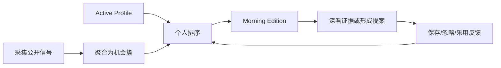

# Personal Drama Radar V1：个人化短剧机会雷达

> 本页保留既有个人化产品设计。2026-09-07 独立 Workbench 已退役，下文相关 Lens/跳转仅为历史背景，当前视觉 owner 为 DSH。2026-09-11 已确定新增[国内外市场变化路径](global-market-radar.md)，目前为规格阶段；原个人 Profile、反馈、机会、Edition 和提案能力继续保留。

## 一句话产品

每天把公开短剧市场信号整理成一份只属于当前创作者的机会清单，并解释“为什么适合你、证据够不够、下一步能做什么”。

它不是面向团队的通用数据后台，也不是另一个热榜搬运器。首版只服务一个本地用户：统一的数据 schema、多个命名 Profile、一个 active profile，以及随真实选择逐步校准的偏好反馈。

## 产品承诺

用户每天不需要重新研究全部平台，只需要完成一个短循环：



V1 应让用户在 3 分钟内完成：

1. 看完 3–8 个高适配机会；
2. 理解每个机会的市场信号、个人适配和证据风险；
3. 保存、忽略或标记已采用；
4. 需要时进入 Workbench/DSH 深看或创建做剧提案草稿。

## 为什么排序“机会”，而不是排序视频

单条爆款视频只是证据，不是可执行方向。Radar 会把相近题材、钩子和形式聚合为稳定机会簇，例如“低成本身份错位 + 强反转 + 60–90 秒单集”，再把不同平台条目挂为证据。

每个个人机会始终分开展示：

| 信号 | 回答的问题 |
| --- | --- |
| `market_score` | 市场信号有多强？ |
| `personal_fit` | 对当前 Profile 有多适合？ |
| `evidence_confidence` | 证据是否新鲜、完整、可信？ |

系统内部可以用版本化公式排序，但不向用户再展示一个混淆三者的“神秘总分”。

## Profile：少量显式配置，持续反馈校准

Profile 记录用户可解释、可修改的偏好：题材、主题、受众、平台、形式、钩子、情绪、预算、风险容忍、blocked topics、已有资产、语言和单集时长。

首次使用只要求三步：

1. 给 Profile 命名；
2. 选择核心题材/受众；
3. 填写明确不做的 blocked topics。

其他维度可以以后逐步补齐。每次修改生成新 revision，旧 Morning Edition 仍引用当时的 Profile，不被重新解释。

反馈只允许：`saved`、`dismissed`、`used`、`not_relevant`、`too_risky`、`already_seen`。反馈对未来排序的影响有上限，不能覆盖用户显式 blocked topics；首版不训练独立个人模型，也不把 Agent memory 当作偏好真源。

## Morning Edition

Morning Edition 默认最多 8 项，宁可空榜，也不以低适配或低置信内容凑数。

每项只先显示：

- 机会标题和一句话描述；
- 三类分数；
- 最多 3 个“适合你的原因”；
- 1 个主要风险或证据限制；
- `Save / Dismiss / Detail / Draft proposal`。CLI 侧 `radar assignment create` 生成不可变生产任务（`ready` 或空榜 `do_not_shoot`）。`radar assignment submit --auctra-path <project>` 调用 Auctra 待审提案入口，成功后才写 `used` 和不透明 proposal refs。Auctra accept 之后 `radar assignment produce --scaena-path <project>` 建 Scaena 项目骨架，不分镜、不生成。拒绝使用 `radar assignment reject --kind too_risky|not_relevant`。

版次状态：

- `ready`：达到当前 Profile 阈值；
- `empty`：没有合格机会，并说明是阈值、blocked topic、重复还是数据原因；
- `degraded`：仍可读，但来源、freshness 或证据存在明确限制。

Edition 是不可变快照。Profile 更新或新反馈只影响下一版。

## 三个使用入口

### CLI：主操作面

CLI 负责 Profile 真源、反馈、构建、诊断和审计：

```bash
radar profile create --name personal
radar profile set --topics sweet-romance,identity-reversal
radar profile activate <profile-ref>
radar run
radar edition show latest
radar feedback add --opportunity <opportunity-ref> --kind saved
```

默认输出给人看；脚本使用 `--json`，Agent 使用 `--agent`，长任务使用 `--events`。

### Hermes：每天最轻的入口

Hermes 默认只读最近一个已完成 Edition，生成个人晨报。它可以基于安全 refs 起草非 canonical 的做剧方向大纲，但不负责采集调度、不修改 Profile、不保存第二份榜单，也不批准或启动做剧生产。

如果当天 Edition 不存在、空、过期或降级，Hermes 应解释原因并给出真实 Radar 命令，而不是自行重复采集。只有用户明确确认并启用 curator lane 时，Hermes 才能写保存/忽略等反馈。

### Workbench 与 DSH：按需深看

Workbench 的 Personal Radar Lens 提供：

- For You：个人版次；
- Opportunity Detail：分数、适配原因、风险与证据；
- My Projects：真实 proposal/handoff receipt；
- Taste & Feedback：Profile 安全摘要与反馈变化。

DSH 提供 Context badge、`/drama radar` 和按需 Pane，适合在与 Agent 工作时快速打开、比较、保存、忽略、起草提案或跳转 Workbench。

两个客户端只消费 Radar 的安全 refs 与 receipts，不读取 SQLite/配置/审计，不拥有排序或 Profile。提案必须经用户接受和下游 owner receipt 后，才能成为 canonical 剧本/项目。

## 边界

V1 明确不做：

- 多用户、团队后台、组织权限；
- 云同步、远程 MCP endpoint、实时通知；
- A2A 或聊天 provider SDK；
- 自动改 Profile、自动批准提案、自动启动剧本/分镜/生成；
- 每人一套独立模型或数据库 schema；
- 用缓存、旧数据或 fixture 冒充当天 live 成功。

`short-drama-radar.card.v1` 继续作为通用榜单兼容输出，个人 Edition 是 additive contract，不把个人字段塞回旧卡片。

## 验证门

### 第一门：14 天单人 canary

- 至少 10 天按时产出可审查 Edition；
- 非空 Edition 中，至少 60% 出现一个 `saved|used`；
- 不可解释或明显误报项不超过 25%；
- 反馈确实改变未来 Edition，但历史版次保持不变；
- 无秘密泄露、跨 Profile 污染或断线后自动重复采集。

### 第二门：5–8 个隔离 Profile/用户样本

同一证据集合应产生可解释的不同顺序，Profile 与反馈不得串线。只有两道门都通过，才讨论公共 Hermes Skill、远程 endpoint 或多用户产品。

## 实施真源

- 子项目 OpenSpec：[`personalized-radar-agent-experience-v1`](../../openspec/changes/archive/2026-09-03-personalized-radar-agent-experience-v1/)
- CLI/MCP 接口：[`mcp-cli-interaction.md`](../interfaces/agent-cli-consumption.md)
- 跨项目 Workbench/DSH handoff：[`personalized-short-drama-radar-experience-v1`](../../../../openspec/changes/archive/2026-09-02-personalized-short-drama-radar-experience-v1/)
