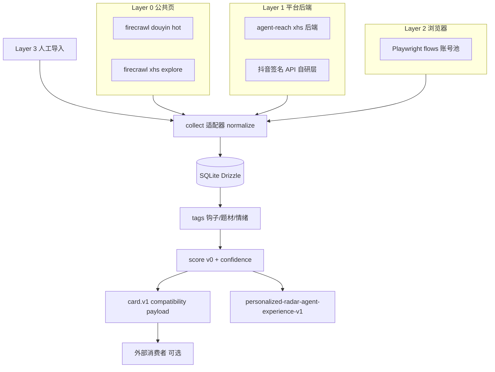

# 设计：爬虫主路短剧雷达

- 编排器为 TS/Bun CLI，子进程调用上游工具，不重写 firecrawl/agent-reach。
- 所有失败降级必须显式记录；凭据不落库。
- 评分与卡片结构见 `src/pipeline/scoring.ts` 与 `src/pipeline/card.ts`。
- 本变更不拥有 Profile、反馈、机会聚类或 Morning Edition；这些 additive 能力由 `openspec/changes/personalized-radar-agent-experience-v1/` 承接，且不得改写 `short-drama-radar.card.v1`。
