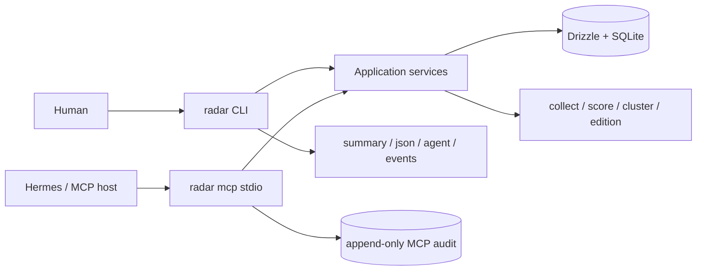

## Context

当前 `short-drama-radar` 已有四层采集骨架、`raw_snapshots`、`daily_items`、`runs`、基础标签/评分和 `short-drama-radar.card.v1`。它能生成通用 Top5+Top5，但没有个人偏好、反馈历史、机会聚类、个人版次或 Agent 安全投影。

本变更面向单个本地用户。用户可能维护多个创作身份或阶段性偏好，但这不等于多租户：没有登录、组织、远端账户和跨设备同步。Hermes、Workbench 与 DSH 都是消费者，Radar 仍是 Profile、反馈、机会、Edition 和运行证据的 canonical owner。

### 能力准入台账

| 能力 | 决策 | canonical owner | V1 位置 |
| --- | --- | --- | --- |
| Profile、revision、active profile | fit | short-drama-radar | 本变更 |
| 反馈、机会聚类、个人重排、Morning Edition | fit | short-drama-radar | 本变更 |
| CLI、stdio MCP、audit | fit | short-drama-radar | 本变更 |
| Hermes 本地 Skill/canary | split-owner | Radar contract + 用户级 Hermes 配置 | 本变更定义合同与 runbook |
| Workbench Personal Radar Lens | split-owner | Workbench consumer + Radar owner | 根级 handoff |
| DSH Drama Radar Pane | split-owner | Harness Plugins consumer + Radar owner | 根级 handoff |
| 剧本/分镜/生成项目 | split-owner | Auctra/Scaena/Eikona 等下游 owner | typed handoff only |
| 远程 endpoint、A2A、实时通知、团队后台 | reject-now | 未批准 | 后续独立立项 |

## Goals / Non-Goals

**Goals:**

- 每天给当前 active profile 生成少而准、可解释的个人短剧机会。
- 同时保留市场热度、个人适配度和证据置信度，避免一个总分掩盖风险。
- 让显式 Profile 与真实反馈共同影响未来排序，并能确定性回放。
- CLI、MCP 和 Hermes 共享同一应用层、状态与降级语义。
- 保持 `short-drama-radar.card.v1` 不变，为旧消费者提供兼容输出。
- 以本地 canary 证明个人化价值后，再决定公共 Skill 或远程服务。

**Non-Goals:**

- 不训练或托管每人一个独立 ML 模型。
- 不建立账户、租户、团队审批、云同步或实时推送平台。
- 不让 Agent 经 MCP 修改 Profile 真源或自动批准生产。
- 不把 Hermes memory、Workbench cache 或 DSH Pane state 当作偏好真相。
- 不在 V1 实现 MCP HTTP/remote endpoint、A2A 或 provider-specific chat adapter。

## Decisions

### 1. 用统一 schema + 版本化 Profile 表达个人差异

个人化数据使用公共合同 `radar.personal_profile.v1`，而不是为每个人派生表结构。一个本地数据库可以保存多个命名 Profile，但只能有一个 active profile；所有未显式传 `--profile` 的个性化命令使用 active profile。

Profile 的首版维度如下：

| 维度 | 类型 | 说明 |
| --- | --- | --- |
| `genres`、`topics`、`audiences` | weighted tags | 想做的题材、主题与受众 |
| `platforms`、`formats` | weighted tags | 目标平台与形态 |
| `hooks`、`emotions` | weighted tags | 偏好的钩子与情绪强度 |
| `budget_band` | enum | `micro / lean / standard / premium` |
| `risk_tolerance` | 0–100 | 生产、题材和平台风险容忍 |
| `blocked_topics` | tags | 排序前硬过滤，不受反馈覆盖 |
| `available_asset_tags` | tags | 已有角色、场景、声音、风格等能力摘要 |
| `languages` | weighted tags | 内容语言 |
| `episode_length_seconds` | range | 可接受的单集时长 |
| `minimum_fit`、`minimum_confidence` | 0–100 | Edition 准入阈值，默认 65/60 |

`personal_profiles` 保存当前 head，`personal_profile_revisions` 保存不可变快照与 digest。任何 `profile set` 都创建新 revision；历史 Edition 只引用 revision，不反向读取当前 head。Profile 结构化写入必须经过 CLI/application service 校验，Agent 不直接拼装数据库记录或配置文件。

### 2. 反馈 append-only，并且只能有界改变未来排序

反馈合同为 `radar.preference_feedback.v1`，kind 固定为：

| kind | V1 排序效果 |
| --- | --- |
| `saved` | 对匹配特征增加 `+2` 信号 |
| `used` | 对匹配特征增加 `+4` 信号，并记录下游 project ref（如有） |
| `dismissed` | 对匹配特征增加 `-2` 信号 |
| `not_relevant` | 对匹配特征增加 `-4` 信号 |
| `too_risky` | 对风险/生产特征增加 `-6` 信号 |
| `already_seen` | 不改变偏好向量；仅抑制相同 evidence digest 的重复展示 |

同一 Profile 的反馈按目标机会特征聚合，最终 adjustment clamp 到 `[-15, +15]`。Profile 的显式 blocked topics 始终优先，反馈不能恢复被硬过滤的机会。反馈只影响新 Edition；已生成 Edition 不重排、不改写。

### 3. 排序主体是机会簇，原始条目只作为证据

`opportunity-builder.v1` 按日期把 `daily_items` 的规范化主 topic、hook family 与 format 组合成稳定 cluster key，并生成 `radar.opportunity.v1`。每个机会至少保留一个 source item ref、证据摘要和 digest；跨平台命中可以成为 reason code，但不能伪造缺失的平台指标。

V1 计算保持简单且确定：

```text
market_score = round(0.70 * max(member_base_score)
                   + 0.30 * mean(top_3_member_base_scores))

evidence_confidence = clamp(round(mean(top_3_member_confidence)
                           - 15 * degraded_member_ratio), 0, 100)

personal_fit = clamp(round(weighted_profile_match + bounded_feedback_adjustment), 0, 100)

internal_rank_score = 0.40 * market_score
                    + 0.50 * personal_fit
                    + 0.10 * evidence_confidence
```

`internal_rank_score` 只用于稳定排序，不作为面向用户的第四个“综合分”展示。并列时依次按 evidence confidence、market score、opportunity ref 排序，保证相同输入得到相同结果。

`radar.personal_opportunity.v1` 必须包含 profile ref/revision、ranker version、三个公开分数、稳定 reason codes、source/evidence refs 和 degraded 状态。推荐 reason codes 只用稳定枚举，例如 `topic_match`、`hook_match`、`asset_reuse`、`budget_fit`、`cross_platform_signal`、`feedback_positive`、`risk_near_limit`、`low_confidence`。

### 4. Morning Edition 是不可变个人版次，允许诚实空榜

`radar.morning_edition.v1` 固定绑定：

- `edition_ref`、date、generated_at；
- profile ref + revision；
- opportunity builder/ranker version；
- source snapshot/run refs 与 evidence digest；
- ranked personal opportunity entries；
- `status: ready | empty | degraded`、known limitations 与 next actions。

默认最多输出 8 个达到 Profile 阈值的机会。没有合格项时生成 `empty` Edition，并解释是阈值、blocked topics、数据缺失还是重复抑制导致；不得用低质量项凑榜。后续反馈、Profile 更新或重跑不会覆盖旧 Edition，而是创建新 ref。

### 5. CLI 是主操作面，四种输出模式共享一个 command result

CLI 经 application service 执行，不在命令 handler、MCP handler 或 renderer 中复制领域逻辑。



计划命令：

```text
radar profile create --name <name>
radar profile show [--profile <ref>]
radar profile set [--profile <ref>] <field flags...>
radar profile activate <profile-ref>
radar feedback add --opportunity <ref> --kind <kind> [--project-ref <ref>]
radar opportunity review --opportunity <ref> --decision <accept|reject|needs_evidence>
radar edition build [date] [--profile <ref>] [--limit 8]
radar edition show [edition-ref|latest] [--profile <ref>]
radar canary report [window-days] [--profile <ref>]
radar collect
radar score [date]
radar cluster build [date]
radar card [date]
radar run
radar runs
radar doctor
radar mcp --transport stdio [--lane reader|curator|operator]
radar mcp doctor
radar mcp capabilities
radar audit tail [--action <action>] [--limit <n>]
```

输出规则：

- 默认 summary：英文短摘要，只给一个主要 next command。
- `--json`：单个标准 envelope，顶层只允许 `spec_version/mode/command/status/summary/facts/actions/evidence/confidence/data/error`；status 固定 `success|partial|failed`，degraded 放在 `facts`/`data`。
- `--agent`：单行 `key=value`，至少包含 `spec_version=1.0`、`mode=agent`、规范化 command id 与 status；大 payload 通过 ref/resource 获取。
- `--events`：仅长任务 `collect`、`run` 使用 NDJSON，至少有 `start` 与最终 `end|error`，每行带递增 `seq` 和 `run_id`。
- stdout 只承载选定模式；诊断到 stderr，任何失败返回非零退出码。

现有 `{ok, app, command, data, errors}` 仅存在于私有 `0.0.1` 草案。实现前先冻结 fixture，再在同一 change 中更新所有本仓脚本和测试；首个公开版本直接发布标准 envelope，不提供 `--legacy-output`。`short-drama-radar.card.v1` 是 data payload 合同，不受 envelope 更正影响。

### 6. MCP 采用 reader / curator / operator 紧凑工具面

`radar mcp --transport stdio` 默认 reader，lane 权限累积：operator 包含 curator/reader，curator 包含 reader。stdout 只允许 MCP JSON-RPC frame；transport 生命周期持续到 stdin 关闭或 signal。

#### `radar.search`

只读且所有 lane 可用。参数：`view: opportunities|items|editions`、`query?`、`date?`、`platform?`、`profile_ref?`、`min_market_score?`、`min_personal_fit?`、`limit?`。未传 profile 时使用 active profile。返回 compact refs 与摘要，明细走 resources。

#### `radar.execute`

| action | lane | 副作用 |
| --- | --- | --- |
| `feedback_add` | curator | append 本地反馈 |
| `opportunity_review` | curator | 写入接受/拒绝/需补证据的 review receipt |
| `collect` | operator | 请求外部平台/采集层 |
| `score` | operator | 本地写基础分 |
| `cluster_build` | operator | 本地生成机会簇 |
| `edition_build` | operator | 本地生成个人 Edition |
| `daily_run` | operator | collect → score → cluster → card + edition |

Profile create/set/activate 不进入 MCP action。Agent 可以返回 profile suggestion，但用户必须运行可审查的 CLI 命令确认。`collect` 与 `daily_run` 的 action metadata 必须声明 external platform side effect，交由 host confirmation policy 决定是否执行。

#### Resources 与 prompt

| URI | 内容 |
| --- | --- |
| `radar://profile/active` | active profile 安全摘要，不含自由备注/凭据 |
| `radar://editions/latest` | active profile 最新 Edition |
| `radar://editions/<ref>` | 指定不可变 Edition |
| `radar://opportunities/<ref>` | 机会、个人解释与 evidence refs |
| `radar://evidence/<ref>` | 脱敏来源摘要 |
| `radar://runs` | 最近运行回执 |
| `radar://sources/status` | 采集层健康、freshness、degraded 状态 |
| `radar://capabilities` | `ready|planned|blocked|unavailable` 与 next action |

唯一 prompt 为 `radar_personal_brief`：先读 capabilities/source status，再读已完成 Edition，最后输出“机会、适配原因、风险、建议下一步”。Prompt 不授予 mutation 权限。

planned/blocked/unavailable 能力只在 `radar://capabilities` 披露，不进入 `tools/list`。V1 不接受 `--endpoint`，capability 显式返回 `unavailable` 与后续立项条件。

### 7. Hermes 是个人入口，不是状态或调度 owner

Hermes canary 以用户级本地 Skill 配置 stdio MCP，默认 reader lane。Morning briefing 只读取最近一个已完成 Edition；如果 Edition stale、empty 或 absent，Hermes 显示原因和可运行的 `radar edition build ...` / `radar run ...` 命令，不自行触发采集。

Hermes 可基于 Edition 生成带 opportunity/profile revision/evidence refs 的非 canonical 提案大纲，也可在用户明确确认后通过 curator lane 写 `saved/dismissed/...` 反馈；提案大纲不得自动持久化为下游项目、批准或启动生产。Profile 修改仍返回 CLI suggestion。Hermes memory 只能保存交互便利信息，不能覆盖 Profile revision、反馈 ledger 或 Edition。14 天 canary 前不发布公共 Skill；V1 不启用 A2A。

### 8. 审计、脱敏与恢复语义在所有入口一致

每次 MCP tool call 在返回前 append `radar.mcp.audit.v1` 到用户级 JSONL，字段仅含 `ts/principal_ref/lane/tool/action/args_digest/outcome/run_ref/edition_ref`。唯一读口为 `radar audit tail`；MCP resource 和 Workbench/DSH 不得读取审计文件。

cookie、代理密码、Authorization、raw provider payload、完整 prompt 和完整思维链不得进入 DB 业务表、stdout/stderr、audit、fixture 或测试证据。账号只显示脱敏 handle。

断线、超时或 unknown outcome 后，客户端只按 run/edition ref lookup/reconcile。`collect` 与 `daily_run` 不得因重连自动重放；feedback 使用 idempotency key 防止重复 append。

### 9. 数据迁移与验证采用 additive、可回滚路径

新增表建议为：

- `personal_profiles`、`personal_profile_revisions`；
- `preference_feedback`；
- `opportunities`、`opportunity_items`；
- `morning_editions`、`morning_edition_entries`；
- `opportunity_reviews`。

全部业务读写继续经 Drizzle repository/application service。迁移只新增表、索引或可空列，不改名/删除旧表；旧 binary 回滚时忽略新表，`card.v1` 继续工作。任何未来删除或字段重用必须另开 migration/deprecation change。

验证层：

1. unit：Profile 校验、blocked filter、反馈 cap、排序 tie-break、空榜。
2. integration：additive migration/rollback、Profile 隔离、历史 Edition 不变、`card.v1` golden 不变。
3. CLI contract：summary/json/agent/events validator、stdout/stderr、exit code、旧草案迁移 fixture。
4. fixture e2e：collect → score → cluster → edition，覆盖 degraded 与 empty。
5. MCP process e2e：initialize/list/call/resource/prompt、lane 拒绝、audit、断线 lookup、不重放 collect。
6. canary：同一证据对不同 Profile 产生可解释的不同顺序；反馈只改变未来 Edition；连续 14 天记录 usefulness 与误报。

所有 integration/component/e2e 证据写入 `temp/integration-test-runs/<run-id>/`，保持原退出码并完成脱敏。

## Risks / Trade-offs

- [冷启动反馈不足] → 首版依赖显式 Profile，反馈只做小幅修正；不伪装成训练完成的推荐模型。
- [规则过多导致不可理解] → 冻结 builder/ranker version、公开 reason codes 和三类分数，内部总分不面向用户。
- [高阈值经常空榜] → 把空榜作为有效结果，并给出是数据、阈值还是 blocked topic 导致的 next action。
- [MCP mutation 误触平台] → reader 默认、lane discovery、host confirmation、idempotency 与不自动重放。
- [个人 Profile 泄露创作策略] → resource 只给安全摘要，审计 CLI-only，客户端不读取数据库或配置文件。
- [预发布 JSON 更正影响本地脚本] → 在同一 change 更新仓内消费者与 golden；首个公开版本前完成，不形成长期双格式。
- [Hermes memory 与真源漂移] → 每次 brief 引用 profile revision/edition ref，冲突时以 Radar resource 为准。

## Migration Plan

1. 冻结现有 `card.v1` 与旧 `--json` 草案 fixtures，建立 additive DB migration。
2. 先落标准 output envelope、Profile/revision 与 `radar doctor`/`radar mcp doctor`。
3. 实现 feedback、机会簇、个人排序和 immutable Edition，保持 `card.v1` 双轨生成。
4. 接入 stdio MCP、lane、resources、audit 与 lifecycle/reconnect 测试。
5. 建立用户级 Hermes reader canary；通过 14 天单人门后再测试 5–8 个隔离 Profile/用户。
6. 若需回滚，恢复旧 binary；新增表保留但不读，不删除 Profile/反馈/Edition 历史。

## Open Questions

- 公共 Hermes Skill 的发布渠道、版本与安装文档只在 canary 达标后决定。
- 远程 endpoint、跨设备同步和实时事件只有出现明确多设备/服务端需求后才立项。
- 下游创作提案的 canonical owner 由具体 handoff target 决定；Radar 只保存 `used` 反馈和不透明 project ref。
