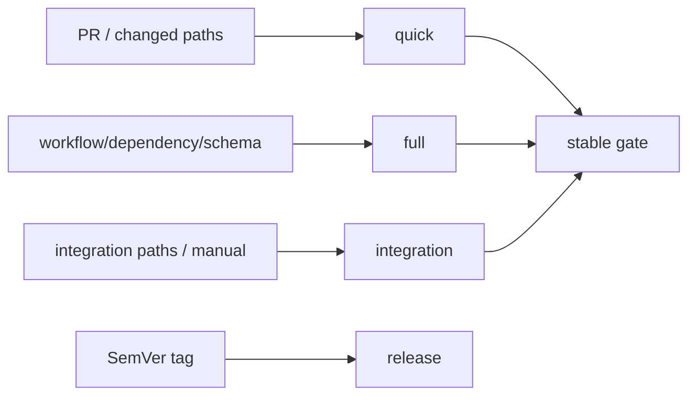

## Context

本 change 只拥有 `cli/short-drama-radar` 内的 workflow、质量命令、项目文档和验证，不把其他仓库作为完成门禁。

## Design

- Profile: `TypeScript/Bun CLI`.
- quick commands: `bun install --frozen-lockfile`, `bun run typecheck`, `bun test`
- full commands: `bun run typecheck`, `bun test`, `RADAR_FIXTURE_DIR=test/fixtures bun run src/cli.ts run --json`
- integration commands: `bun run test:integration`
- release: No live-platform or automatic publish lane; normal CI stays fixture-only.
- workflow 顶层默认只读；PR checkout 不持久化 credential。
- 手动 dispatch 不得正式发布，tag publish 必须复跑 mandatory gates。

## Compatibility

已有 workflow/job 名不删除。新增场景先以加法方式上线；如果后续迁移 branch protection，由项目 owner 单独执行。

## Rollback

如果新增 workflow 产生不可接受的重复运行，可先禁用新增 trigger 并保留原 required check；不得删除原门禁或 release history。
