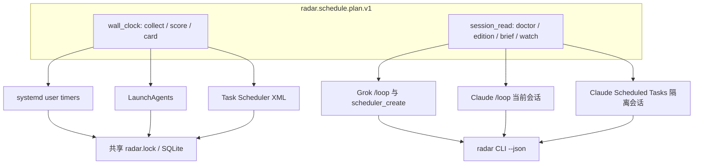

# 设计：跨平台 OS 调度 + Claude 式 session 任务

## 边界

| 能力 | 判定 | Owner | 说明 |
|---|---|---|---|
| 墙钟采集/评分/出卡 | fit | `cli/short-drama-radar` | collect/score/card 必须在会话关闭后仍能触发 |
| macOS launchd / Windows Task Scheduler 单元 | fit | 同上 | 与 systemd 同源任务图 |
| session 任务计划投影 | fit | 同上 | CLI 生成计划，不执行循环 |
| Claude `/loop`、Scheduled Tasks | reject-now（Radar 实现） | Claude Code | Radar 只提供 prompt/cron 载荷 |
| Grok `/loop`、`scheduler_create` | reject-now（Radar 实现） | Grok runtime | 同上 |
| Agent Reach watch | split-owner | Agent Reach + Radar session-plan 引用 | 只读健康，不写入 Radar DB |
| 通用跨产品调度服务 | reject-now | — | 不新建 owner |

## 两层调度

墙钟层回答「笔记本合上、Agent 没开，早上 08:10 仍要采」。session 层回答「我正在和 Agent 干活，隔一段时间帮我看 edition/brief/doctor，不要自己去 live collect」。

## 任务图

| id | class | 本地时刻 | 会话默认 | 原因 |
|---|---|---|---|---|
| collect | wall_clock | 08:10、08:30 | 禁止当作成功替代 | 必须墙钟；会话关闭即漏采 |
| score | wall_clock | 08:42 | 否 | 依赖当天 collect |
| card | wall_clock | 08:55、08:59 | 否 | 兼容出卡窗口 |
| cluster/edition build | 人工或 curator session | 出卡之后 | 提醒，不默认自动写 | 现有 systemd 也不跑 edition |
| market analyze/brief | wall_clock | 08:50、09:00 | 否 | 独立单元，observe 仍 planned |
| doctor + edition show + brief show | session_read | 间隔 1d 或 cron `0 9 * * *` | 是 | 只读 |
| agent-reach watch | session_read 伴随 | 1d | 可选 | 第三方健康，不写 Radar |

## OS 后端

- **Linux**：保持现有 systemd 文本（OnCalendar、flock、After/Wants、Persistent=true）。`auto` 在 `linux` 上仍写 `~/.config/systemd/user`。
- **macOS**：`~/Library/LaunchAgents/com.yeisme.short-drama-radar.{collect,score,card}.plist`。`StartCalendarInterval` 对应同一组本地时刻；`KeepAlive=false`；日志进 `~/.short-drama-radar/logs/`。启用命令打印 `launchctl bootstrap`/`load -w`，不代为启用。
- **Windows**：用户级 Task Scheduler XML，`StartWhenAvailable=true`（漏触发补跑），`MultipleInstancesPolicy=IgnoreNew`，`InteractiveToken` + `LeastPrivilege`。启用命令打印 `schtasks /Create /TN ... /XML ...`。
- 单元由 CLI 生成，禁止手写 JSON/plist/XML 当真源。
- 凭据、Cookie、代理密码不得进入单元文件。

macOS 默认没有 `flock(1)`。第一刀 OS 单元直接调 CLI；并发保护继续依赖 SQLite `busy_timeout` 与错开的本地时刻。CLI 内跨平台文件锁作为后续任务，不阻塞生成器。

## Session 合同

`radar schedule session-plan --runtime grok|claude|both` 生成 `radar.schedule.session_plan.v1`：

- Grok：`/loop 1d <prompt>` 与 `scheduler_create` 字段（interval/prompt/durable）。Grok 间隔不是 cron，不能表达「每天 08:10」；文档必须写明。
- Claude `/loop`：仅当前会话，会话结束即停。
- Claude Scheduled Tasks（研究预览）：隔离会话 + cron，更接近墙钟，但仍要求 Claude 运行时可用，不能替代 OS collect。
- prompt 必须自包含：detached subagent 看不到原对话。
- 默认 prompt 禁止 `radar collect` / `radar run` / `market observe --confirm-live`。
- 7 天过期、最多 50 条等限制由运行时执行；Radar 只在 limitations 里复述。

## Doctor

按 `process.platform` 探测对应已安装单元，不把「文件已写」说成「已启用」。无 systemd/launchctl/schtasks 时 `schedule` 为 `unavailable|blocked`，`nextCommand` 指向 `radar schedule session-plan`，并列出本机应使用的 OS install 命令。

## 兼容

- Linux 上 `radar schedule install` 无 `--backend` 时行为与现网一致。
- 现有 systemd golden 测试不得改期望文本。
- 不启用市场 observe timer，不改 card.v1。
