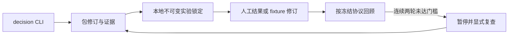

# 决策与实验实现设计

## 目标与边界

fit：Radar 拥有候选、证据引用、基线记录、冻结的实验条件和脱敏结果回顾。split-owner：内容生产仍归 Auctra／Scaena，界面归 DSH。reject-now：自动招募、收费、生成、远端数据库与新客户端。使用现有 Bun／TypeScript／Drizzle，不新增依赖。

## 状态与存储

三个新表分别保存决策包修订、实验锁定、结果修订；数据库初始化只增加表和索引。包修订记录每次命令键与参数摘要，实验和结果同样具备幂等键；立即事务保证读改写与幂等检查原子化。有 active Profile 时绑定该 Profile；无 Profile 时为本地共享研究，避免创建首个 Profile 后孤立已有包。两者都按当前内容禁区检查，具名 Profile 包不跨 Profile 读取；列表过滤不可读内容。

包内保存有限数量的证据与候选。URL 证据是人工来源说明，系统不联网验证。市场证据通过指定 signal revision 及其 evidence ref 绑定已有安全投影，目录证据不能标成需求证据。候选要求已存在证据、市场、语言、受众、假设、风险、推翻条件和成本说明。机会不自动排序，显式选择实验候选。

基线必须明确为 missing 或 independent；independent 是带证据的人工声明，不是系统认证。独立基线必须先于候选建立，设置后不可改；缺失原始基线的包不能升级为方法对照，需新建包并取得独立输入。候选假设实验可保留 missing。

每次 lock 引用当前包修订，冻结同市场／语言／受众的两个候选、实验类型、样本、阈值、预算／招募说明和当前策略。锁定由本机时钟生成，不允许用户回填。它是 local lock，不宣称第三方预注册或防管理员篡改。之后编辑包只影响未来实验，旧锁定可回查。

每个实验只能有一个当前结果；更正用新修订和 reason 追加，旧结果保留。观察时间不得早于锁定或晚于录入，origin 在更正时不变。记录每组 assigned／continued／completed／technical_failures，继续与完成不强制从属（可提前选择下一集）。结果需明确 observed 或 intent、质量是否可比及来源引用。系统不取得受试者身份，不把人工聚合数认证为事实。

report 只使用冻结的阈值：不足样本、意愿调查、fixture、质量不齐或故障率超限均为 inconclusive；有效人工观测才输出 directional_support／no_advantage。方法和假设实验分组，协议改变不合并，纠正结果后重新计算并标明结果修订。两轮连续有效不达标，或同协议两轮执行不可比，暂停新锁定；resume 通过包修订记录复查原因，保留历史且不自动执行外部动作。上一实验没有结果时不能开启下一实验。

## 兼容与回退

CLI 新增 decision 组，既有参数解析与命令语义保留；该组拒绝多余位置参数、重复标量参数、无值和未知参数。复用 summary／json／agent／explain／events 渲染，事件保持既有 event 字段。新增三个表不改变旧表和 PG allowlist；旧版本回退后忽略新表，保留新数据供恢复，不做 DROP。breaking_surfaces=[]，无需弃用窗口。

## 验证

先运行纯规则与输入单测，再通过已有 integration-test-run.ts 跑服务／临时数据库／CLI 进程闭环；失败同样保留脱敏证据。覆盖历史修订、幂等冲突、并发陈旧写入、Profile／禁区、秘密输入、证据越界、基线顺序、冻结、结果更正、样本／时间／指标约束、两轮暂停与恢复、原表数据保存、多模式输出和命令错误。最终再运行 typecheck、完整 Bun 测试和 OpenSpec strict 验证。执行证据在验证结束后引用，软件通过不代表受众有效。

OpenSpec CLI 当前没有任务状态修改命令，因此由本项目 scripts/decision-pilot-check.ts 生成任务骨架，并且仅在真实验证通过后写完成状态与证据路径。该脚本复用原证据 runner，不创建第二套测试框架；归档后拒绝修改历史任务。

## 2026-09-16 验证结论

本地软件完成。19 项新增检查覆盖 4 项纯规则与 15 项集成／CLI 行为。最终 `bun run scripts/decision-pilot-check.ts --verify` 通过类型检查、完整 343 项测试及 OpenSpec strict 验证；1 项真实 PG 同步集成因没有 Docker 与 RADAR_TEST_PG_URL 被明确跳过。完整测试证据为 `temp/integration-test-runs/2026-09-16T12-09-08-416Z-vqp6tb/`，任务状态由脚本生成。

首次全量验证发现新增 decision 表尚未进入既有 PG 排除声明，归因为本次引入，已仅补充三个表名；12 表归档 allowlist 不变。另补充 fixture 不清除真实失败序列的回归。旧 card golden、CLI envelope、市场 handoff 与 assignment 行为测试继续通过。没有执行真实受众实验、生成、发布、数据采购或远端变更。

范围内剩余限制：结果为人工报告，本地锁定不提供第三方防篡改认证；决策包历史列举采用个人规模扫描；没有增加 MCP 或自动生产交接。后续新增能力需新建变更，不能修改已归档任务继续实施。
