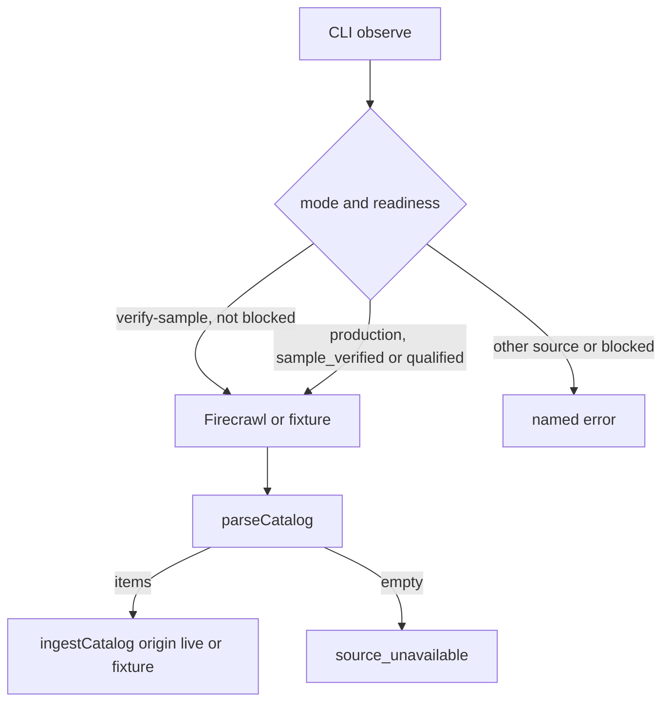

## Context

红果 HTML 解析与 import-catalog 已有。缺的是 live 抓取门和 assignment。资格 7 日规则保持不变：验证采样可在未 qualified 时写入 live batch，但不把覆盖标成熟，也不生成 observe timer。

## Goals / Non-Goals

**Goals**

- 红果 verify-sample：`--confirm-live` 抓 `https://novelquickapp.com/category`，origin=live。
- production observe：仅 `sample_verified|qualified`。
- 登录页/空目录/`source_unavailable`；超时 60s。
- assignment 幂等、过期 Edition 拒绝、空榜 `do_not_shoot`。

**Non-Goals**

- 其他来源 live、自动 qualified、Auctra 写入、MCP observe。

## Decisions

1. 将 `ingestCatalog` 内化，允许 live；公开 `importCatalog` 拒绝 live。
2. observe 不改 source readiness。
3. assignment 表 `radar_assignments`；idempotency_key 默认 `edition+opportunity+profileRevision+brief`。
4. `used` 仍只由未来 Auctra 回执写入。

## Risks / Trade-offs

- Firecrawl 或页面改版 → 诚实失败。
- 验证采样 live 天会计入资格分母，失败日也算。

## Migration / Rollback

新表 IF NOT EXISTS。回滚停用命令。旧 import 行为不变。

## Open Questions

无。7 日资格仍走既有 source plan/check/review。
