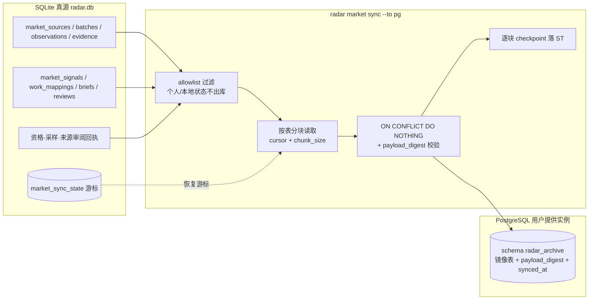
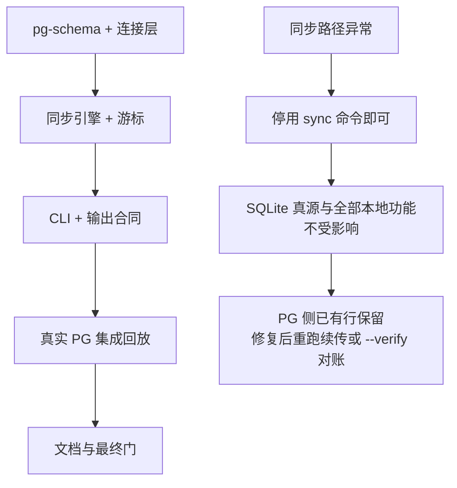

# Radar 市场域 PostgreSQL 归档同步

## 1. 目标、证据与能力账本

现状（2026-09-16 核实）：市场域持久化只有 Drizzle over `bun:sqlite`（`~/.short-drama-radar/radar.db`，`RADAR_HOME`/`RADAR_DB_PATH` 可重定向）；`src/db/schema.ts` 已含全部市场表，`src/db/client.ts` 的 `migrate()` 集中 DDL；`src/market/repository.ts` 的 batch digest、ref/revision 主键与 `marketDigest()` 提供了现成的幂等键材料；红果 live 采样已真实落库 24 部作品。缺的是长期归档层与跨机分析副本。

| 能力 | Owner／入口 | 验收锚点 | 状态 |
|---|---|---|---|
| 市场域数据归档到用户提供的 PG | Radar／`radar market sync --to pg` | 幂等 upsert、断点续传、对账 | fit，本 change |
| SQLite 真源与证据不可变 | Radar／既有 repository | PG 永不回写、冲突只报不改 | fit，本 change 守边界 |
| 连接串凭据安全 | Radar／config＋诊断 | 只来自 env/用户级 config，全链路脱敏 | fit，本 change |
| 多用户 HTTP API 长期存储 | `backend-server/radar-api`（Go+GORM） | 独立 OpenSpec 与授权 | split-owner，后续独立决策 |
| 服务端、remote endpoint、云同步 | 无 | canary 前禁止 | reject-now |

范围记录：fit=本地 CLI 归档基础设施；split-owner=未来多用户 API；reject-now=在本 change 内新增任何服务端或把 PG 变成真源。

## 2. 数据流与最小实现结构

- 不创建后台服务器、消息队列或第二真源。同步是 CLI 内的一次性进程：读完一块、写一块、落一次 checkpoint，进程退出即结束。
- 业务读写全部走 Drizzle：SQLite 侧复用既有 schema；PG 侧新增 `src/db/pg-schema.ts`（`drizzle-orm/pg-core` 镜像同一批表），DDL 集中在 `src/db/pg-client.ts` 的 `migratePg()`，与 sqlite 侧 `migrate()` 同一约定。禁止在 market 服务或 CLI handler 里拼裸 SQL。
- PG 镜像表在 SQLite 列之外只新增两列：`payload_digest TEXT NOT NULL`（`marketDigest(payload)`，冲突校验用）与 `synced_at TIMESTAMPTZ NOT NULL DEFAULT now()`（归档时间，不参与业务语义）。
- 幂等键设计（与 SQLite 主键一一对应）：

| 表 | 幂等键 | 游标排序 |
|---|---|---|
| market_sources | (ref, revision) | (ref, revision) |
| market_batches | ref | (observed_at, ref) |
| market_observations | ref | (observed_at, ref) |
| market_evidence | ref | (observed_at, ref) |
| market_signals | (ref, revision) | (observed_at, ref, revision) |
| market_work_mappings | (ref, revision) | (ref, revision) |
| market_briefs | ref | (generated_at, ref) |
| market_reviews | ref | (window_end, ref) |
| market_sampling_plans | (source_ref, source_revision) | (source_ref, source_revision) |
| market_sampling_checks | batch_ref | batch_ref |
| market_qualification_records | ref | ref |
| market_source_reviews | key | key |

- 不同步（留在本机）：reader/watch 阅读与关注状态、personal Profile/feedback、opportunities/morning editions、radar_assignments、runs、raw_snapshots/daily_items 旧两平台管线、input_requests。理由：它们是本地个人状态或可由市场域证据重建的派生物，归档只覆盖 `radar.market.*.v1` 合同承载的证据链。旧管线表若日后需要归档，以扩充 allowlist 的独立变更处理。

## 3. 命令合同与输出

拟新增（实现前不可当作已存在入口）：

| 命令 | 作用 |
|---|---|
| `radar market sync --to pg` | 从上次 checkpoint 继续增量同步；无 checkpoint 时全量首同步 |
| `radar market sync --to pg --verify` | 只读对账：逐表行数比对＋按幂等键抽样的 payload_digest 比对，零写入 |
| `radar market sync --to pg --reset-cursor --confirm-reset` | 显式清空本机游标后全量重放（PG 侧已有行因幂等键不重复，digest 不一致才报错） |
| `radar market sync --to pg --chunk-size N` | 分块大小，默认 500，界 1–5000 |

- `--to` 首版只接受 `pg`，其他值报 `sync_target_unsupported`，为未来目标保留枚举位。
- 命令 id 为 `radar.market.sync`，复用标准 envelope：facts 含 `tables`、`rows_synced`、`rows_reused`、`chunks`、`resumed`、`pg_source=env|config`、`pg_target`（脱敏 host/db/schema 摘要）；长同步走 start→phase（逐表 `table_synced`）→end 事件流，失败走终局 error 事件。
- `sync` 不改写任何 SQLite 市场表，不触碰 source readiness、信号修订或简报；它只追加 `market_sync_state`。同步失败不影响任何本地读写路径。

## 4. 断点续传、幂等与冲突语义

- `market_sync_state`（SQLite，DDL 集中进 `migrate()`）：`table_name` 主键、`cursor_json`、`target_fingerprint`、`rows_synced`、`last_synced_at`。游标值是该表已确认写入 PG 的最大排序键；只有 PG 事务提交成功才推进游标，两块之间进程死亡后重跑从上一已提交块继续，重复行由幂等键吸收。
- 目标指纹 `target_fingerprint` = sha256(host|port|dbname|schema)（不含用户名/口令）。更换目标报 `sync_target_changed`，须 `--allow-target-change` 显式确认，防止把两个实例的数据混进同一游标线。
- 写入语义：`INSERT ... ON CONFLICT (pk) DO NOTHING`；对冲突行回查 `payload_digest`：一致记 `reused`，不一致报 `sync_conflict`（表名＋幂等键＋两侧 digest 前 12 位），中止该表、游标停在该块之前，其他表不受影响。已有行永不 UPDATE/DELETE——不可变证据在副本侧同样不可改写。
- `--verify` 零写入：逐表比较行数，并按幂等键有序抽样（默认每表至多 100 行）比对 `payload_digest`；不一致逐条列出，退出码非零。

## 5. 连接串来源、凭据安全与 pg 驱动选择

- 来源优先级：环境变量 `RADAR_PG_URL` → 用户级 config（`RADAR_CONFIG_PATH` 或 `~/.short-drama-radar/config.json`）的 `pgArchive.url`。两者皆无报 `pg_config_missing`，并给出英文恢复提示（设置 env 或编辑用户级 config）。
- 凭据绝不进入：SQLite/PG 业务表、stdout/stderr、events、envelope、`--explain`、集成测试证据、fixture、`market_sync_state`（只存不含凭据的 target_fingerprint）。诊断与 doctor 只显示：来源类型（`env|config`）、脱敏 host/db/schema、`target_fingerprint` 前 12 位。config 文件含 `pgArchive.url` 时启动检查权限位，非 owner-only（非 0600）给英文警告但不阻止（与本地单用户 CLI 惯例一致）。
- 驱动选择 `postgres`（postgres.js）：drizzle-orm 0.44.7 的 pg 驱动是 optional peer，官方支持 `pg`（node-postgres）与 `postgres`（postgres.js）两种。选 `postgres` 的理由：纯 JS 无原生绑定，Bun 下无编译/兼容风险，符合本仓库纯运行时偏好；`drizzle-orm/postgres-js` 为一等驱动，支持 `onConflictDoNothing` 与事务 API 与 bun-sqlite 侧同构；依赖体积小、无 callback 遗留层。`pg` 仅在出现 postgres.js 无法表达的能力缺口时再评估。
- 连接参数有界：单条连接、连接超时 10s、单语句超时 60s、idle 超时 10s；不使用连接池守护进程，进程结束即断开。

## 6. 错误与恢复注册表

错误为拟新增稳定英文 code，各路径返回具体原因，不用 catch-all 吞掉。

| 路径／code | 触发 | 恢复与用户所见 |
|---|---|---|
| sync/pg_config_missing | 无 `RADAR_PG_URL` 且 config 无 `pgArchive.url` | 提示两种配置位置，零写入 |
| sync/pg_unavailable | 连接/超时/网络失败 | 本次退出码非零；重跑同一命令即续传 |
| sync/pg_auth_failed | 认证被拒 | 只提示检查凭据来源，不回显 DSN 任何片段 |
| sync/schema_mismatch | `radar_archive` 表结构不符（如手工改过） | 提示由 owner 重置该 schema 或修复后重跑 |
| sync/sync_target_changed | target_fingerprint 变化 | 需 `--allow-target-change` 显式确认 |
| sync/sync_conflict | 同幂等键不同 payload_digest | 中止该表，列出键与两侧 digest 摘要，owner 审查后决定；绝不自动覆盖 |
| sync/cursor_invalid | 游标 JSON 损坏或越界 | 拒绝续传，提示 `--reset-cursor --confirm-reset` 全量重放（幂等安全） |
| sync/sync_target_unsupported | `--to` 非 `pg` | 列出支持目标 |
| sync/flag_invalid；value_required | 非法 flag/缺值 | 沿用 market checkFlags 惯例 |

同步流水只记录表名、行数、块号、错误码与脱敏 target 摘要；不持久化 DSN、凭据、完整行 payload 之外的任何请求细节。

## 7. 与调度器的关系

- 同步默认手动触发，不进入任何自动定时器。
- `radar market schedule show/install` 的说明文本增加一条可选挂接：owner 可在 `market-brief` 单元之后自行追加执行 `radar market sync --to pg` 的 systemd unit（给出示例片段），但 `install` 不生成、不启用 sync 定时器；与既有“写单元≠启用”的语义一致。
- 调度的既有单元（collect/score/card、market-analyze、market-brief）逐键不变；同步不在 cutoff/freeze 语义内，迟同步只是副本落后，不影响真源。

## 8. 场景、测试与证据

复用 Bun test、disposable SQLite 与 `scripts/integration-test-run.ts`，不建立第二测试框架。拟新增：

- unit：连接来源解析与脱敏（含畸形 DSN、config 合并、权限位警告）、分块/游标推进纯函数、冲突分类与错误码映射、envelope/agent/events 输出合同。
- integration（真实 PG）：优先 Testcontainers（`testcontainers` 的 `PostgreSqlContainer`）；环境无 Docker 时降级为 `RADAR_TEST_PG_URL` 指向的一次性实例，两者皆无则该文件显式 skip 并在 summary 中记录 `pg_integration_skipped`，不得伪造通过。覆盖：首同步全量→重放零新增、中途杀进程后续传行数一致、`sync_conflict` 中止且零改写、`--verify` 检出篡改、`sync_target_changed` 门、游标损坏恢复。
- 证据：集成运行写 `temp/integration-test-runs/<run-id>/` 全套文件，DSN 以 `<redacted>` 占位进 `env.json`/`command.txt`；失败保留证据与原退出码。
- 全量门（代码稳定后）：`bun run typecheck`、`bun test`、`bun run test:integration`、`openspec validate radar-market-pg-sync-v1 --strict --no-interactive`。

## 9. 上线、回退与完成边界

- 回退：移除/不调用 sync 命令即完成回退；SQLite 无行为变化，PG 副本是只增不改的旁路产物。
- 初版不做：多用户 HTTP API（`backend-server/radar-api`，Go+GORM，独立决策）、remote endpoint、双向同步、PG 侧读取投影进 MCP、自动定时同步、旧两平台管线表归档、个人状态归档。
