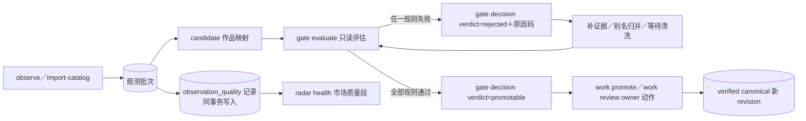
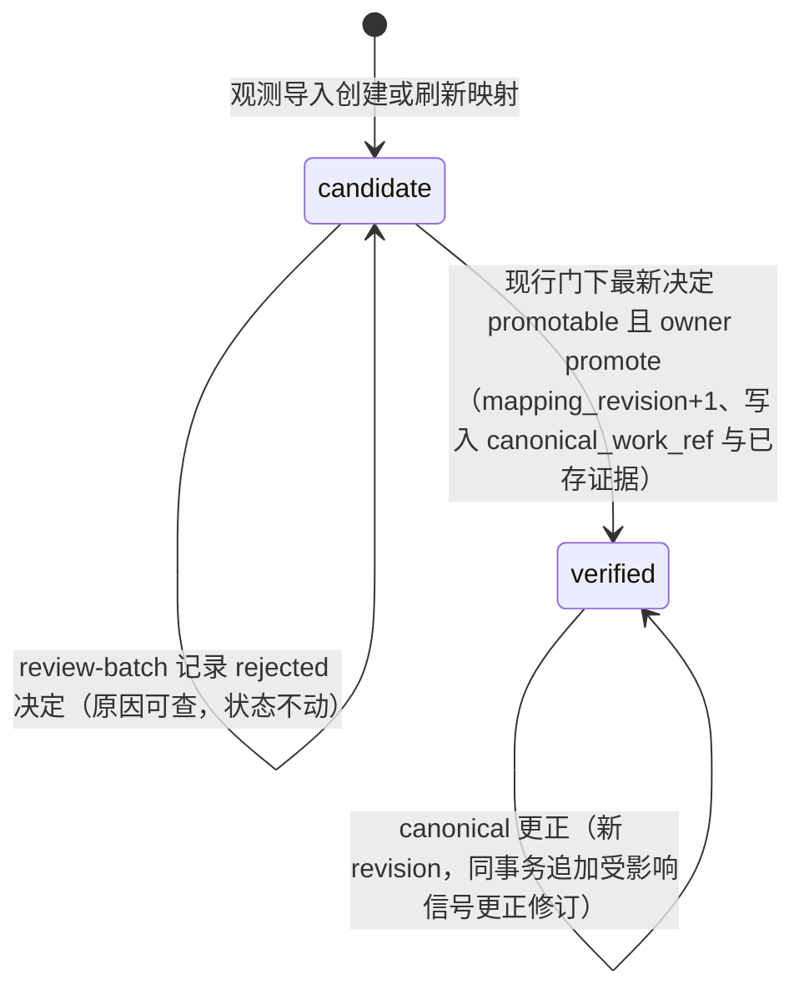
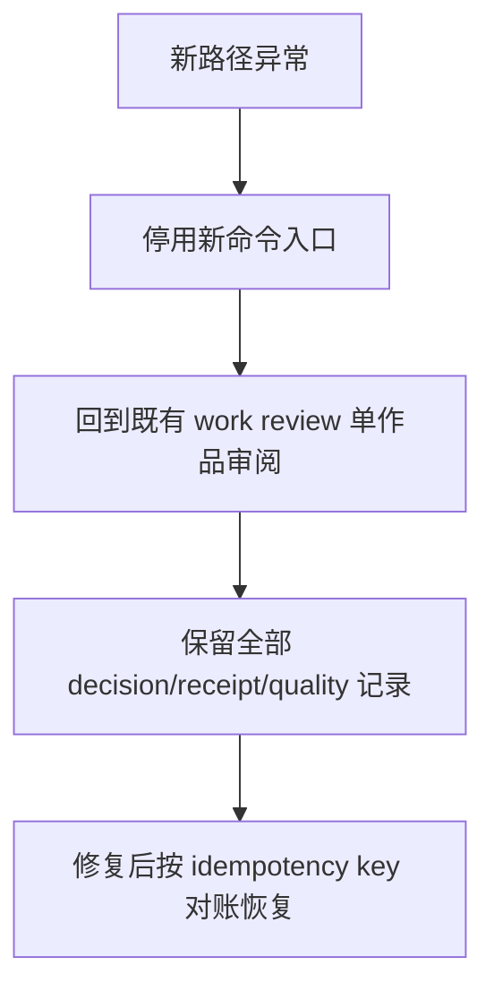

# Radar 作品正式入库门

## 1. 目标、证据与能力账本

让 candidate 作品映射有一条可运营、可审计的正式入库路径：满足版本化门规则的作品经显式 owner 动作晋级为 canonical（`mapping_status=verified` 且写入 `canonical_work_ref`），不满足的作品保留 candidate 并留下可查询的拒绝原因；同时把每次观测的解析质量沉淀为可量化回归的指标。

现状证据（2026-09-16）：

- 红果 live 采样 24 部作品全部 `mapping_status=candidate`、`canonical_work_ref=null`；没有任何机制区分「还没审」和「审了但不合格」。
- `src/market/identity.ts` 已有 `reviewWorkMapping`/`reviewWorkIdentity`：单作品 owner 审阅、revision+1、幂等重放、陈旧拒绝，verified 变更同事务追加信号更正修订。本变更复用该底层动作，不重新定义。
- `src/market/catalog.ts` 的 `ingestCatalog` 回执已返回 `field_coverage` 与 `skipped_links`，但不持久化，跨日无法比较。
- `src/pipeline/health.ts` 的 `buildHealthReport` 只覆盖旧两平台 pipeline；`radar market canary report` 仍是具名 `capability_unavailable` 的 planned 能力。

| 能力 | Owner／入口 | 实现组 | 验收锚点 | 状态 |
|---|---|---|---|---|
| 入库门规则与 gate decision | Radar／CLI | G1 | S01–S04 | retained |
| 批量 review、门控 promote、幂等回执 | Radar／owner CLI | G2 | S05–S08 | retained |
| 观测质量记录与 health 回归 | Radar／observe/import、health | G3 | S09–S11 | retained |
| 字段覆盖门槛对接清洗后解析质量 | Radar／依赖 Lane A | G3 | S10 | staged |
| 来源资格、简报、读者状态、旧 work review | 原 owner 和入口 | 全程 | S12 | retained |

范围记录：fit=入库门、批量审核、质量指标，均为 Radar 领域状态；split-owner=无新外部消费者（DSH/Agent 继续走既有只读投影）；reject-now=自动晋级、绕过门的后台任务、把 fixture 证据计入真实验证、为审核新增 MCP 写入 lane。

外部依赖：并行变更 `radar-hongguo-catalog-parsing-v1`（红果标题/标签解析清洗）记为 Lane A。本变更的规则模型、批量审核与质量持久化不依赖 Lane A；只有「必需字段覆盖达标」规则在清洗后字段上的绑定依赖 Lane A 完成（见 tasks 3.4）。spec 撰写不阻塞。

## 2. 数据流与状态机

状态机说明：映射本身只有 candidate/verified 两态；promotable/rejected 是 gate decision 的判定结果，不是映射状态。被拒绝的作品留在 candidate，拒绝历史以不可变 decision 记录保存；重新评估产生新 decision，不改写旧记录。verified 永不自动降级（沿用 `refreshWorkCandidate` 既有语义）。

## 3. 入库门规则与判定合同

新合同命名为 `radar.work_ingestion_gate.v1`（规则集）、`radar.work_gate_decision.v1`（判定记录）。以下是设计中的新对象，不代表当前 API 已提供。

规则集 `work-ingestion-gate-rules.v1` 固定四条规则；阈值随规则集版本化，调整必须产生新 `gate_version` 并保留旧版本下的全部决定：

| rule_id | 检查内容 | 失败原因码 |
|---|---|---|
| `stable_identity` | 同一 (source_ref, source_item_id) 在至少 2 个独立观测批次中出现且身份无漂移（subject 推导一致、标题无未解释变更） | `identity_not_corroborated` |
| `alias_reconciliation` | original_title 完整保留、aliases 无未决冲突；同名跨作品歧义必须显式处理，不自动合并 | `alias_conflict`／`identity_ambiguous` |
| `required_field_coverage` | 该作品最新观测的必需字段达到规则集声明的字段下限（首版字段集引用 `catalog-fields.v1`；清洗后字段版本随 Lane A 落地绑定，见 §5） | `field_coverage_below_floor` |
| `evidence_floor` | supporting_evidence_refs 全部指向已存 market evidence，且至少一条非 fixture 证据（manual/live）；fixture 永不计入真实验证 | `evidence_missing`／`fixture_only_evidence` |

判定与记录规则：

- `gate evaluate` 是纯只读投影：给定 mapping revision 与观测/证据现状输出逐规则结果，不写库；同一输入同一 `gate_version` 结果确定。
- 决定记录 `radar.work_gate_decision.v1`：decision_ref、platform_work_ref、mapping_revision、gate_version、verdict（promotable/rejected）、reason_codes、rule_results、evidence_refs、evaluated_at、来源 scope（单作品或 review batch ref）。记录不可变；同一作品在新证据或新 gate_version 下重新评估产生新 decision_ref，旧决定保持可读。
- 映射 revision 前进后，旧 revision 的决定自动失效：operative decision 定义为「该作品在现行 gate_version 下、针对当前 head revision 的最新决定」。对陈旧 revision 的 promote 引用返回具名拒绝，不静默采用旧判定。
- canonical 化必须走显式 owner 动作：晋级写入 `canonical_work_ref` 与 1–10 条已存证据 refs，产生 mapping_revision+1；底层复用 `reviewWorkIdentity`，verified canonical 变更继续同事务为受影响信号追加更正修订。观测、证据与历史映射 revision 一律不回写。
- 入库门不改变来源 readiness，不自动晋级：observe/import 永不触发 promote；没有任何定时器、后台任务或分析流程会依据门结果自行改写映射。

## 4. 批量 review 与幂等回执

新合同 `radar.work_review_batch_receipt.v1`。以下命令属于实现目标，当前不可当作已存在入口：

| CLI 命令组（拟新增） | 作用／权限 |
|---|---|
| `radar market work gate show` | 只读：当前规则集版本、逐规则阈值与字段集 |
| `radar market work gate report [--source <ref>] [--batch <batch_ref>]` | 只读评估投影：范围内 candidate 的 verdict 分布、原因码计数、逐作品明细 |
| `radar market work review-batch --source <ref> [--batch <batch_ref>] --key <idempotency_key>` | owner：对范围内全部 candidate 记录 gate decision（一次事务），返回回执 |
| `radar market work review-batch-receipt --key <key>` | 只读：按键查询原回执，断线恢复用 |
| `radar market work promote --work <ref> --revision <n> --canonical <ref> --evidence <refs...> [--override-reason <text>]` | owner：门控晋级；未通过具名拒绝，override 必须留原因 |
| `radar market work gate decisions --work <ref>` | 只读：该作品的决定历史 |

- 批量筛选范围为「来源（可选叠加批次）下当前 head 为 candidate 的映射」；范围为空返回 `evaluated=0` 的合法空回执，不伪造成处理成功有结果，也不报错抹掉「审过但没有候选」这一事实。
- 回执含 idempotency_key、payload_digest、scope、evaluated/promotable/rejected 计数、reason 分布与全部 decision_refs。同键同参重放返回原回执且零新 decision；同键异参拒绝 `idempotency_conflict`；断线结果未知先按键对账，未查清不重放。
- 批量动作只记录决定，不晋级。晋级是逐作品的显式 promote：要求 operative decision 为 promotable，否则 `gate_not_passed` 并附当前原因码；`--override-reason` 允许 owner 越过门，但会在同一事务记录一条 `overridden=true` 的决定，原因文本入库可审计，规则本身不变。
- 所有 mutation 只走 CLI/application service：decision、receipt、quality 记录与映射写入禁止手工改库、禁止手写 JSON/YAML 资产。既有 `work list/show/review` 命令与 flag 惯例（`--work/--revision/--canonical/--evidence`）保持不变。
- 首版不新增 MCP 写入 lane；外部 Agent/DSH 继续经既有只读投影消费，审核节奏由 owner host 执行。

## 5. 观测质量指标闭环

新合同 `radar.observation_quality.v1`：quality_ref、batch_ref（一对一）、source_ref/revision、observed_at、origin、parser_version、items、field_coverage（逐字段 present/total）、skipped（foreign_or_unsafe_link/no_work_identity/title_invalid 归因计数）、digest。

- observe 与 import-catalog 在写入观测批次的同一事务写质量记录；批次重放复用原批次，质量记录同样幂等不重复。记录不可变、不含原始 HTML、URL 之外的页面内容或任何凭据。
- `radar health` 增加市场观测质量段：窗口内逐来源的字段覆盖率首末对比、skip 率趋势与批次计数；与前一等长窗口相比覆盖率下降超过版本化阈值（拟 `quality-regression.v1`，默认 10 个百分点）标 `regression_flagged`，这是可见告警不是构建失败门。历史无质量记录的批次在报告中显式 `quality_unavailable`，不回填、不假装有数据。
- planned 的 `radar market canary report` 实现时必须消费质量记录作为覆盖与解析退化证据；本变更不实现 market canary，只在合同上锁定该消费关系。
- 与 Lane A 的衔接：`required_field_coverage` 首版按 `catalog-fields.v1` 既有字段评估；`radar-hongguo-catalog-parsing-v1` 落地后，红果的字段集与 parser_version 升级为清洗后版本，门评估引用清洗后的解析质量，旧 `gate_version` 下的决定保持原义不追溯重判。

## 6. 错误与恢复注册表

错误是拟新增稳定英文 code；各路径返回具体原因，不用 catch-all 吞掉。

| 路径／code | 触发 | 恢复与用户所见 | 测试 |
|---|---|---|---|
| review-batch/source_not_found | 来源未注册 | 提示先 market init；零写入 | S05 |
| review-batch/idempotency_conflict | 同键异参 | 拒绝并返回原回执 key | S07 |
| review-batch/outcome_unknown | 断线结果未知 | 先 review-batch-receipt 对账，未查清不重放 | S07 |
| promote/gate_not_passed | 无 promotable operative decision | 返回当前原因码与 gate report 入口；override 需显式原因 | S06 |
| promote/stale_gate_decision | 决定针对陈旧 mapping revision | 要求重新评估，不静默采用旧判定 | S06 |
| promote/state_conflict；evidence_not_found；identity_not_found | 沿用既有 review 语义 | 重读当前映射或补已存证据 | S06 |
| evaluate/gate_version_unknown | 请求不存在的规则版本 | 具名拒绝，列出可用版本 | S03 |
| health/quality_unavailable | 历史批次无质量记录 | 显式标注，不回填 | S11 |

## 7. 场景、测试与证据

复用 Bun test、Drizzle disposable SQLite 与 `scripts/integration-test-run.ts`；不建立第二测试框架。拟新增 focused 文件在 tasks 中标注，先实现再执行。

- S01 规则模型：四条规则逐条 happy/失败分支；非法规则集、未知原因码拒绝。
- S02 决定不可变：重复记录幂等、重评估产生新 decision_ref、旧决定可读、跨 gate_version 不追溯。
- S03 评估确定性：同一输入同版本结果一致；`gate_version_unknown` 具名拒绝。
- S04 证据下限：仅 fixture 证据的 candidate 判 rejected（`fixture_only_evidence`）；manual/live 证据通过。
- S05 批量范围：按来源/批次筛选正确；空范围合法空回执；未注册来源具名拒绝。
- S06 门控 promote：无决定/被拒绝/陈旧决定分别具名拒绝；通过后晋级留 revision+1 与证据；override 留审计决定；verified 不被后续观测降级。
- S07 回执幂等：同键同参重放零新决定、同键异参拒绝、断线按键对账恢复。
- S08 信号联动：promote 后 canonical 变更沿用既有更正链（同事务信号更正修订），不重复、不倒写。
- S09 质量持久化：observe/import 同事务写质量记录；批次重放零重复；记录无原始 markup/凭据。
- S10 覆盖门槛：字段缺失作品判 `field_coverage_below_floor`；Lane A 清洗字段接入后红果字段集升级且旧决定不追溯（Lane A 完成后验证）。
- S11 health 质量段：覆盖率下降超阈值标 regression_flagged；无记录批次显式 quality_unavailable。
- S12 旧合同回归：既有 market/简报/读者/个人 pipeline 测试全绿，`work review` 原语义不变。

集成/组件/e2e 写 `temp/integration-test-runs/<run-id>/` 的 summary.json、command.txt、stdout.log、stderr.log、env.json、artifacts/；失败保留证据与原 exit code。单元阶段只运行所属 focused 文件；稳定后一次完成 `bun run typecheck`、`bun test`、`bun run test:integration` 和本 change 的 strict validate。

## 8. 上线、回退与完成边界

初版不做：自动晋级、MCP 审核写入、多用户审批流、把门结果当作品质量评分、对历史批次回填质量数据。软件门可在全部 offline/合同测试通过时单独报告；Lane A 依赖任务在其变更完成前保持未完成，不以「跳过」标完成。
