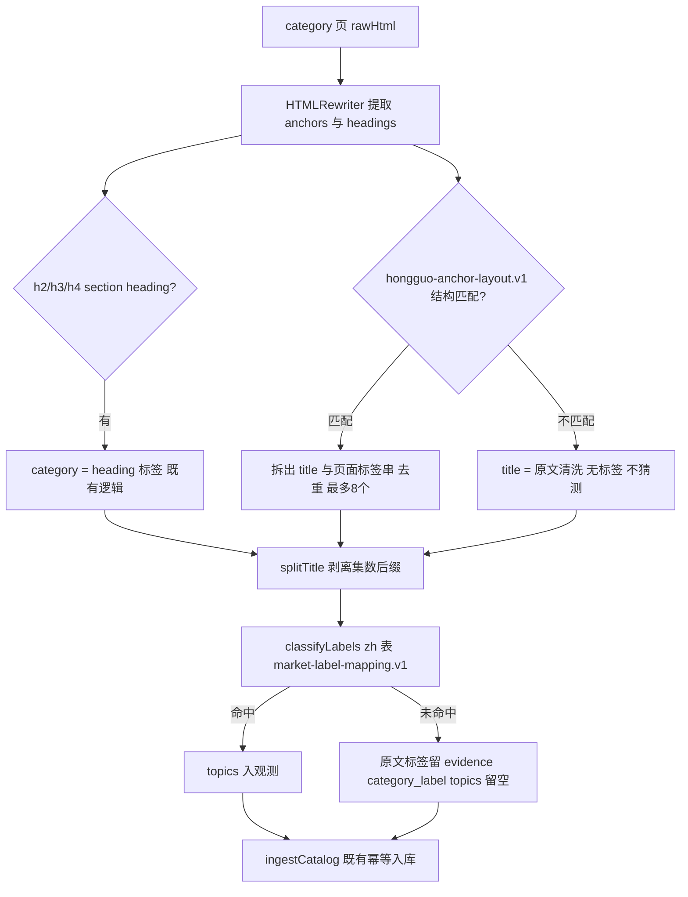
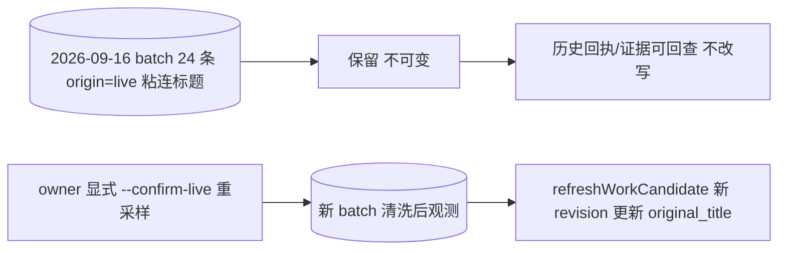

# Radar 红果目录解析清洗 v1

## 1. 背景、证据与能力账本

2026-09-16 真实采样回执（`radar market observe --source hongguo --mode verify-sample --confirm-live`，页面 `https://novelquickapp.com/category`）：24 部作品入库（origin=live），`field_coverage.episode_count = 24/24`，`field_coverage.category = 0/24`，`skipped_links.no_work_identity = 32`，`skipped_links.foreign_or_unsafe_link = 2`。产品文档 `docs/product/global-market-radar.md` 已知限制段已记录：标题存在「标题重复两遍+标签串」粘连，红果样本在解析清洗与入库门交付前不可作为 canonical 数据消费。

根因分析（对照 `src/market/catalog.ts`）：

1. `splitTitle` 只剥离集数后缀（`EPISODE_PATTERNS`），不认识红果 anchor 的「标题×2 + 标签串」结构，整串原样成为 title。
2. category 仅来自 `h2/h3/h4` section heading 继承；真实页面分类标签粘在 anchor 文本里而不在 heading 中，因此所有作品 `category = null`，`classifyLabels` 无从消费。
3. `no_work_identity = 32` 是同 host 下非作品页链接（导航、播放页、登录/隐私等）按既有设计被跳过；需要复核归因是否正确、是否有可恢复的作品链接被误跳，并把真实原因写进 limitations，而不是默默接受一个无法解释的大跳过数。

| 能力 | Owner／入口 | 验收锚点 | 状态 |
|---|---|---|---|
| 红果 anchor 结构拆分（title + 标签串） | Radar／`parseCatalog` hongguo 分支 | S01–S03 | 本变更新增 |
| 页面自带标签的版本化映射消费 | Radar／`classification.ts` | S02、S04 | 本变更新增 |
| 跳过归因复核与解释 | Radar／解析器 limitations | S05 | 本变更新增 |
| 存量 24 条观测的重采样兼容 | Radar／observe/identity 既有合同 | S06 | 本变更新增 |
| 来源资格与 observe 门禁不变 | Radar／`observe.ts` | S07 | retained（显式边界） |

范围记录：fit=红果目录解析清洗与映射消费；reject-now=晋级 hongguo readiness、猜测题材/关键词匹配剧情长文、改写已入库证据、改动其他来源解析器、自动重采样。

## 2. 解析修正的数据流

关键决定：

1. **anchor 结构规则显式版本化、仅 hongguo**：命名 `hongguo-anchor-layout.v1`，形式为「同一标题连续出现两次（允许空白分隔）后接题材标签串」的确定性判定。识别失败时 title 保持原文、标签为空——宁可保留粘连标题待下一轮规则修订，也不输出半猜半拆的结果。规则只适用于 `source === "hongguo"` 的 HTML 解析路径，reelshort/dramabox/markdown 路径行为不变。
2. **标签只来自页面自身结构与版本化映射**：拆分得到的标签串先过 `safeLabel` 同类校验，再按当前 source revision 绑定的 `market-label-mapping.v1` zh 表经 `classifyLabels` 消费。映射表没有的标签保留原文进 evidence `category_label`、topics 留空（既有合同）。禁止用关键词在标题/剧情长文里猜题材。若需为 zh 表补充标签，每个新增词条必须在夹具/真实样本中有页面证据，并在 design 或 PR 说明中列出依据。
3. **section heading 继承保留**：heading 给出的 category 仍是合法来源；当 anchor 自带标签串与 heading 同时存在时，anchor 自带标签优先（更贴近作品），两者都缺失则 category=null。这与「category labels come from the source page」的既有 limitation 一致。
4. **覆盖率口径不变**：`field_coverage.category` 继续计「有题材标签的作品数」。fixture 验收目标：接近 100%（脱敏真实结构夹具中除结构性无标签项外全覆盖）；标题断言不含「标题×2」重复串；`no_work_identity` 跳过数与归因解释随回执 limitations 一并给出。

## 3. 存量 24 条观测的处理策略

- 已入库的 observations 与 `marketEvidence` payload **不改写**：它们是 2026-09-16 页面状态的不可变证据，粘连标题本身就是要修复的缺陷记录。
- 解析修正**不自动重放**旧内容；重采样是 owner 显式动作（`--confirm-live`），产生新 batch。由于观测 ref 的 digest 含 `observed_at`，新观测是新 revision 而非覆盖。
- candidate work mapping：同一 `series_id` 的 `workSubjectRef` 稳定，重采样后 `refreshWorkCandidate` 以清洗后 title 生成下一个 mapping revision（原 revision 保留可查）；若 mapping 已被 owner review 为 verified，自动刷新不降级（既有 `identity.ts` 合同）。
- 重采样前，旧 24 条观测在消费侧仍按「已知限制」处理：产品文档已声明红果样本不可作为 canonical 数据消费，本变更不解除该声明——解除属于修复验证完成后的文档更新任务。
- `--fixture` 路径只验证解析逻辑，产生的 origin=fixture 数据不与 live 混淆，也不用于资格晋级。

## 4. 跳过归因复核

`no_work_identity = 32`、`foreign_or_unsafe_link = 2` 出自 `parseCatalog` 的既有分流：同 host 但不符合 `/detail?series_id=` 身份的链接计前者，异 host/非 https/带凭据的计后者。复核要求：

- 用 2026-09-16 真实结构的脱敏夹具逐条核对 32 条被跳链接的 URL 形态，归类为「导航/榜单/播放页/登录隐私等确认非作品页」或「疑似作品链接但身份提取失败」。
- 若发现身份提取缺陷（如作品链接走另一路径形态），修复 `identity()` 并在夹具中断言修复前后跳过数差异；若全部确属非作品页，把归因摘要写进回执 limitations，让「跳过 32」成为可解释数字而非噪音。
- `foreign_or_unsafe_link = 2` 同样给出去敏归类（外链/追踪参数等），不回显完整可疑 URL 到日志。

## 5. 显式边界（本变更不做什么）

- hongguo readiness 保持 `planned`；不晋级 `sample_verified`/`qualified`，不改变 `observe.ts` 的 verify-sample/production 门禁，不生成或启用 observe timer。
- 不把清洗后的题材标签当作「类目覆盖成熟」证据；`topic_mix_changed` 等信号命题的既有证据门不变。
- 不改动 `card.v1`、旧 MCP views/resources、个人 Profile/反馈/Edition。
- 不做关键词题材猜测、不引入 LLM 分类、不采购数据。

## 6. 错误与恢复

| 路径／触发 | 行为 | 恢复 |
|---|---|---|
| anchor 结构部分匹配（标题只出现一次/标签串为空） | 回退原文 title、无标签，不报错 | 下一轮规则修订；limitations 提示结构性无标签 |
| 标签不在映射表 | 原文入 evidence、topics 空 | owner 评估是否扩 `market-label-mapping.v1` zh 表（需页面证据） |
| 页面改版导致无可解析作品 | 既有 `source_unavailable`，零写入 | owner 核对页面后修订规则版本 |
| 重采样与旧 batch 时间冲突 | digest 含 observed_at，天然新 revision | 无需恢复；旧数据保留 |

## 7. 测试与证据策略

复用 Bun test、Drizzle disposable SQLite 与 `scripts/integration-test-run.ts`；不新建测试框架。

- 新增脱敏夹具 `test/fixtures/market/hongguo-live-2026-09-16.html`：按真实样本结构合成「标题×2+标签串」anchor、集数文本、section heading 有无、导航/播放/外链等被跳链接形态；不含真实 cookie/追踪参数，作品名用示例名或真实公开标题（公开目录页标题属公开信息，可引用）。
- unit：`test/unit/market-hongguo.test.ts` 扩展或新增 `market-hongguo-anchor.test.ts`——粘连标题拆分、标签映射命中/未命中、结构不匹配回退、heading 与 anchor 标签优先级、跳过归因计数。
- integration：observe fixture 路径回放，断言 `field_coverage.category` 接近全量、标题无重复串、origin=fixture 不污染 live。
- 全量门（实现稳定后）：`bun run typecheck`、`bun test`、`bun run test:integration`、`openspec validate radar-hongguo-catalog-parsing-v1 --strict --no-interactive`。
- owner 重采样为可选外部验证（需 `--confirm-live`），不是软件门完成条件；执行与否单独报告。

## 8. 上线、回退与完成边界

软件门：解析修正 + 夹具/测试全绿 + strict validate。回退：解析规则为纯函数分支，回滚即恢复旧行为；旧数据本就不改写，无数据迁移。完成边界：本变更交付解析清洗与验证；hongguo 持续资格（7 日规则）仍属既有变更 `radar-market-observation-and-brief-v1` 的任务 5.4，不在此宣称。

## Open Questions

- ~~32 条 `no_work_identity` 的最终归因分类~~（2026-09-16 复核已关闭）：同页只读复核（77 个 anchor：24 作品 + 45 同 host + 8 外链/非 https）确认全部被跳链接为首页/导航（2）、分类与题材过滤（34）、榜单（5）、分页（4），无一 `/detail` 作品链接被误跳——**不存在身份提取缺陷**，`identity()` 不修复；外链归因为备案/证照外链（6）与非 https 协议（http/mailto，2）。与采样回执 32/2 的计数差异源于页面分页与页脚渲染随抓取变化，归因类别一致。归因摘要经 `skip_attribution` 写入回执 limitations。
