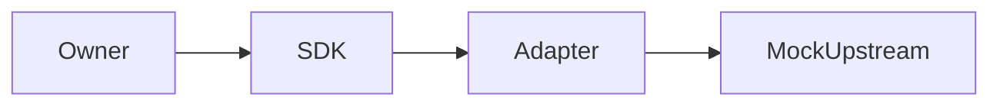

# Design

## Context

现有领域 seam 与公共 SDK 不同且 CLI 只有 fixture，无法进行真实合同联调。

## Decisions

保留历史 seam/fixture，新增 bridge 将领域数据映射至公共 SDK；SDK 本地打包随项目固定依赖；新增显式 HTTP endpoint/model/临时认证 env 名参数，cache 绑定 transport/model/mode；回放不访问网络。

## Compatibility and rollback

仅修复文档合同违例与新增 opt-in 路径，原字段、fixture、历史 evidence 和默认 off 不变。不需要弃用窗口；关闭 HTTP 路径可回滚到 fixture，安全漏洞修复不回滚。SDK 包未公开发布，采用包管理器生成的本仓 tarball 依赖，不引入 sibling runtime import。

## Validation

运行 owner 的 focused tests 与现有 evidence runner；覆盖失败、脱敏、零重试、零网络回放及真实公共 SDK/adapter 的 mock 联调，最后严格校验本 change。
