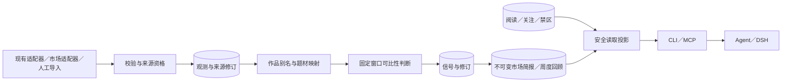
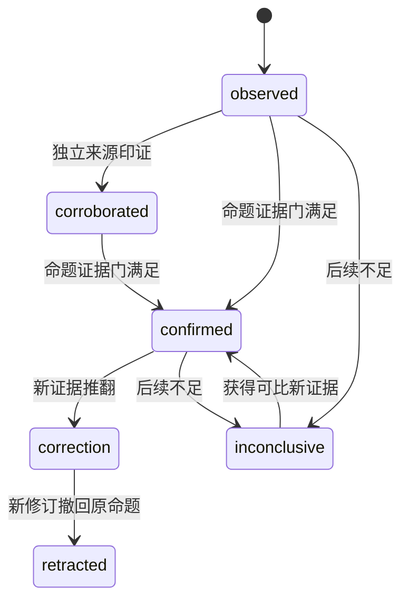
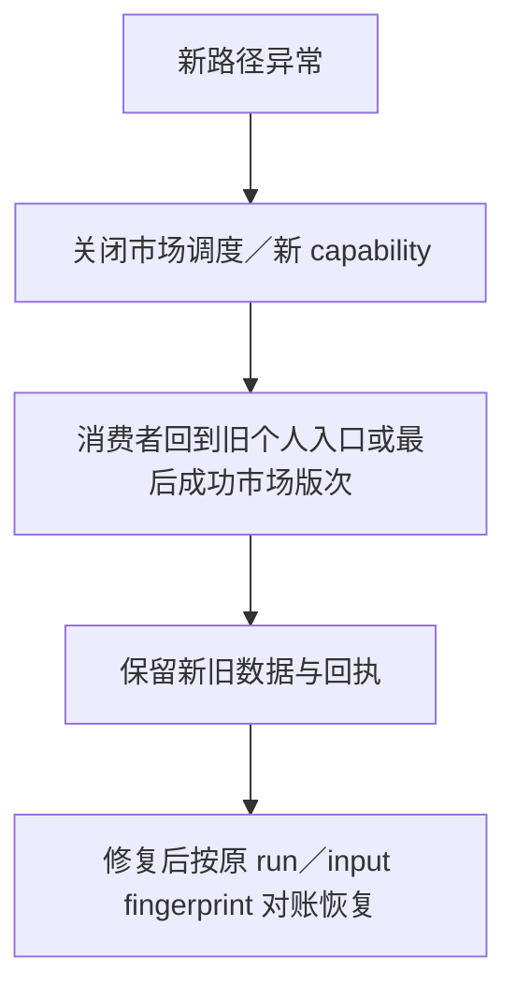

# Radar 市场观测、信号与简报

## 1. 目标、证据与能力账本

以公开证据为基础，帮助单一本地用户在 3–5 分钟内掌握国内外短剧变化，并按需追踪、查证。内容变化为主，平台/公司/投放信息只作独立背景，不混排成“全球热度分”。来源矩阵、调研日期与局限见 [产品文档](../../../docs/product/global-market-radar.md)。

现状：card.trends 为空；现有 score 按平台/当天样本归一化且单次采集回退累计互动，不能直接跨日比较；RawItem/Adapter 只允许两平台；schedule 只执行 collect/score/card；市场功能尚未实现。复用既有 snapshots、application actions、Drizzle、幂等回执、MCP lane 及证据 runner，避免复制一套采集服务。

| 能力 | Owner／入口 | 实现组 | 验收锚点 | 状态 |
|---|---|---|---|---|
| 国内外、多地区、主动发现与红果核心观察 | Radar／CLI、Agent、DSH | R1 | S01–S04 | retained |
| 真人/漫剧及 AI 制作证据区分 | Radar／分类投影 | R1 | S05 | retained |
| 可比变化、可信/待观察分层、每日简报 | Radar／Agent、DSH | R2 | S06–S11 | retained |
| 阅读补看、观察清单 | Radar／显式 CLI/MCP 动作 | R3 | S12–S14 | retained |
| 跨市场对照、周度判断回顾 | Radar／Agent、DSH | R3 | S15–S16 | retained |
| 有出处问答与无本机 CLI 消费 | Radar 证据／外部 Agent 解释 | R4 | S17–S18 | moved behind contract |
| 原 Profile/反馈/个人推荐/提案/card/Edition | 原 owner 和入口 | 全程 | S19 | retained |
| 公开数据优先、付费按缺口评估 | Radar／资格与试用报告 | R1、R5 | S20 | staged |

范围记录：用户接受五项扩展和充分扩展；平台由 Agent 提供候选；原个人选题能力只调整入口优先级、不删除。fit=Radar 领域状态；split-owner=Agent 解释和 DSH 视觉；reject-now=独立 Workbench、远程服务、聊天 SDK、自动采购及做剧生产。

## 2. 数据流与最小实现结构

在当前 application service 内增加 market 模块；不创建后台服务器、消息队列或独立数据库。旧适配器通过窄 bridge 提供 observations，新的宽平台集合不反向扩大旧 card.v1 的两平台字段。重复原文不入新存储：复用可引用的既有 snapshot，新增记录保存 normalized facts、provenance 和安全摘要；必要的新增来源观测仍由 Radar 独有。

业务读写用 Drizzle；DDL 集中 migrate()。先增表/索引，不删除旧列、不改旧分数含义。一次 observation batch、一个 brief＋entries、一个 reader mutation＋receipt 均事务提交。正常查询按 source/market/time、signal/ref/revision、reader 范围建索引，不在热路径全表反序列化。

## 3. 来源与观测合同

新合同命名为 radar.market_source.v1、radar.market_observation.v1。以下是设计中的新字段，不代表当前 API 已提供。

| 对象 | 最小字段与规则 |
|---|---|
| Source | source_ref、revision、platform、role、publisher_group、official_identity_evidence、market_scope、locale、collection_method、metric_definitions、sampling_scope、freshness_budget、readiness、limitations |
| Observation | observation_ref、source_ref/revision、source_item_id、source_snapshot_ref、observed_at、source_published_at（可空）、market（可 unknown/global）、locale、format、production_method、facts、evidence_refs、collection_run_ref |
| Metric fact | name、value、unit、basis（cumulative/interval/rank/placement）、window、definition_version、sample_denominator（可空） |
| Work mapping | platform_work_ref、canonical_work_ref（可空）、原名/别名、mapping_revision、mapping_status（candidate/verified）、supporting_evidence_refs |

- market 是有来源依据的观测地区，语言、商店可用地区、受众地区分别保存；不得把英语网页映射为美国受众。
- format=live_action/animation/mixed/unknown；production_method=ai/non_ai/mixed/unknown。漫剧入口不自动推出 AI 制作。UI 可双轨阅读，未知项有独立可见出口。
- 身份以来源稳定 ID 为优先；同名、译名相近只能建立 candidate，不自动合并。verified 映射改动必须版本化并重新生成受影响信号修订，历史版次不改写。
- 同一源一次 observation batch 重放不增加样本；跨账号转载按作品/原始证据血缘去重。publisher_group 相同或证据转载链相同，不计为独立印证。
- 人工导入、fixture 与 live 来源分别标记，fixture 永不计入真实验证；导入只能通过 CLI/application service 或已实现的 input-intake 合同，不把客户端文件路径当服务端可读路径。
- 来源说明可由内置 TypeScript 描述符通过 CLI seed/init 生成；配置、资格记录、观测与回执禁止手写 JSON/YAML。

### 来源资格

readiness 使用 planned/identity_verified/sample_verified/qualified/blocked；观察周期中的 health 单独为 fresh/stale/partial/unavailable，不能用一个状态兼任“能读”和“正在正常读”。

sample_verified 至少有一份脱敏解析样本、稳定 ID/口径检查及失败样本；qualified 要求至少 7 个连续日、每天至少两个按该来源固定计划采集的成功观测，口径一致且无未解释的 ID 漂移。此门只代表声明 sampling_scope 稳定，不代表全平台覆盖。低频周报等来源可作为背景，不能用于每日定量趋势，亦不强行改成每日来源。

各候选平台都必须得到资格结果；不能因无法自动采集而从来源账本移除。遇到账号、付费、权限或反自动化限制，记录 blocked 原因和公共/人工替代；当前任务不自动开账号、采购或绕过风控。未通过的目标地区显示覆盖缺口。

日更目录默认 freshness_budget 为 26 小时；低频来源必须另行声明窗口，未声明则 freshness_unknown，不能参与每日定量变化。7 日资格和题材每窗 10 个作品是首版保守工程默认，不是已校准的统计显著性结论；调整必须改变规则版本并保留原验证结果。

## 4. 可比性、信号及排序

comparison_key 由 source/revision、market、采样范围、metric definition、时间窗口规则、分类映射版本组成；规则变动重新建立 baseline。两次可比观测才可确认数值或位置变化。累计量须先转同时间间隔增量；计数回置、缺值、零分母或采样不齐时不计算百分比。名次仅同榜比较，首页推荐只算 placement，现有 daily score 不进入跨日涨跌。

首版支持有限、可验证的 claim_kind：

| claim_kind | 证据门 | 可以说什么 |
|---|---|---|
| newly_observed | 一份合法观测 | 本系统首次观察到；不称全网上新 |
| listing_changed | 相同采样范围两份目录快照 | 目录新增/移除；不足时不能说下架 |
| rank_changed | 同一榜单与口径的两个位置 | 该榜单名次变化 |
| metric_changed | 同定义、同窗口的两组有效数据 | 声明口径内的指标变化 |
| topic_mix_changed | 固定且完整的采样框、同映射版本、每窗至少 10 个独立作品 | 样本内题材供给占比变化，不称用户偏好 |
| cross_market_observed | 两个有地区依据的观测集 | 在不同地区观察到相似题材；不推断传播因果 |
| correction | 引用先前 signal revision 及反证/映射修订 | 对此前命题更正，原文与依据可回查 |

assertion_level=observed/corroborated/confirmed，表示对具体命题的证据等级，不表示商业成功概率。corroborated 要有两个独立来源组；confirmed 要通过该 claim_kind 的证据门。仅有转载或关键词猜测不能晋级。不得输出“高概率爆款”等无验证预测。

初版分类复用平台标签与版本化中英/西语/葡语/印尼语/印地语映射，泰语等新增映射同样版本化。未知标签保留原始安全文本并标 unknown。Agent 可提出解释或映射建议，但未经 owner 验证不写 canonical 分类或 confirmed 命题；不新增 Radar 内嵌 LLM provider/Agent 运行服务。

signal_ref 表示跨版次持续跟踪的同一命题主体，revision 单调递增；内容摘要变化、证据修订和 lifecycle 变化产生新 revision。lifecycle=active/cooled/retracted/inconclusive；cooled 必须有可比的下降证据；缺失后续数据是 inconclusive，不能自动判失败。

图表示分析进展；assertion_level 与 lifecycle 分字段持久化，不把 correction 当成旧记录原位修改。

简报只选本窗新修订。排序使用版本化确定顺序：更正优先、已确认优先、来源优先级、独立证据组数、最近有效观测时间、signal_ref；关注摘要单独计算，不改变市场事实。主摘要最多 5 条、待观察最多 2 条；同一题材主摘要最多 2 条，剩余可深看。更正超额时显示更正计数和完整列表入口，不静默遗漏。无合格变化允许 0 条，不以低置信内容补位。

在证据门和更正优先满足后，若国内、海外均有合格变化，主摘要至少各保留一条，再按上述顺序填充剩余位置；更正占满时用可见的市场分区入口呈现溢出。某地区无合格变化不强行填位，区分“无重大变化”和“覆盖不足”。不同内容形式同样可在筛选与完整列表访问，不以默认摘要上限隐藏整条观察轨道。

## 5. 简报、截止时间和调度

radar.market_brief.v1 保存 brief_ref、revision/digest、timezone、window_start/end、generated_at、baseline_refs、source_run_refs、analysis/mapping versions、signal_refs/revisions、coverage、limitations、status。与个人 morning_edition.v1 分开，brief 不要求 Profile。

- 默认 timezone=UTC，首次配置明确显示，可通过 owner CLI 设置 IANA timezone；不从中文推断所在地。
- 默认每日当地 09:00 出版，窗口为前一截止点到本次截止点；迟到观测进入后续版次并保留原 observed_at，不倒写历史。
- 比较可读过去 7 个已完成观察日；不足则明确 baseline_insufficient。没有重大变化和缺数据是不同状态。
- brief 及 entries 原子且不可变；相同输入指纹复用同一 brief；更正或迟到数据创建新 ref，并关联 supersedes。状态 ready/empty/degraded/absent 与顶层 envelope success/partial/failed 分离。
- 为新市场 pipeline 增加单独的 owner 调度单元；普通 read/refresh 只重读，不调用 observe。失败有上界，来源任务到截止点未完成时冻结 partial 版次。
- 默认每个公共目录源每天两次观察，间隔 12 小时；来源策略更严格时服从来源。单源超时 60 秒、最多两次只读重试、退避 2/8 秒、全局并发 2；登录失败/验证码不自动重试，沿用 24 小时风控冷却。
- 在无 systemd 环境只生成安装说明和显式 CLI 路径，不能报告后台已经调度；定时器安装、启用及真实采集属于后续 owner 操作。

## 6. 读者状态、内容禁区及五项扩展

首版单一本地 reader_ref=local，不新增账户/多租户系统。市场阅读设置与创作 Profile 分开；当前 active Profile 的明确 blocked_topics 与 reader 额外禁区取并集，只作为服务端硬过滤，不使用 personal_fit/预算/普通偏好过滤。无 active Profile 时仍可读。policy_revision 绑定读取结果，Profile/禁区改变后旧投影失效；详情、搜索、问答、来源证据和历史读取都重新应用禁区，防止深链绕过。禁止未分类内容无法判定命中时，返回待审说明，不给出未经检查的正文。

阅读记录是 (reader_ref, signal_ref, revision) 的显式确认，不是日期游标，不因打开页面、LLM tools/read 或停留时间自动前进。相同动作幂等；“标记本期已读”只确认当前屏幕政策下实际展示的 refs/revisions，不标记隐藏或分页未显示项。允许撤销已读；两个入口并发操作用 reader revision，冲突返回 state_conflict 并重读，不能吞掉较新的动作。

补看返回未读的新 revision，默认回看 30 天、分页 20 条；更久提供历史入口与边界说明。简报外更正也按修订进入补看。多次略过不当作 dislike，不改变市场信号或创作反馈。

观察清单支持 topic/work/platform/market 的已解析 opaque refs，状态 active/paused/removed；暂停不消耗未读进度，恢复展示暂停期间有记录的变化。关注缺数据时提示 source_gap，不以空列表表示无变化。关注与原 saved/used/dismissed 分别存储。

跨市场对照以 topic_ref 或 verified work mapping 为轴，两侧保留各自原名、地区依据、时间窗口、指标定义和限制。不同口径不画共用数值轴；未知地区不强配某国。相似题材、译名候选、同作翻译和已证实传播关系分别表达。

每周一默认当地 09:10 生成前一个完整周的回顾，引用当时修订＋截止时后续证据；输出 sustained/cooled/retracted/inconclusive。回顾不是预测准确率，无后续不能算判断失败。14 天试用至少覆盖一次有后续证据的回顾及一次缺失分支。

## 7. 拟新增接口与消费者恢复

以下命令/动作属于实现目标，当前不可当作已存在入口。使用现有 radar 二进制，不新增 daemon。所有 mutation 支持显式幂等键并返回 receipt；同键不同 payload 拒绝。

| 新 payload schema | 最小身份与责任 |
|---|---|
| radar.market_signal.v1 | signal_ref/revision、claim_kind、assertion_level、lifecycle、comparison/evidence refs、规则版本及限制；历史修订不可变 |
| radar.market_reader.v1 | reader_ref/revision、policy_revision、显式已读 signal revisions、分页边界；不包含创作反馈 |
| radar.market_watch.v1 | watch_ref、reader_ref、target kind/ref、state、revision；取消保留历史 |
| radar.market_comparison.v1 | comparison_ref、两侧 market/subject/evidence/window/metric definition、mapping revision 与不可比原因 |
| radar.market_review.v1 | review_ref/digest、week window、原 signal revisions、截止时后续 evidence、四种回顾结果 |
| radar.market_question_context.v1 | signal/policy revision、问题、受限摘要、fact/inference/unknown 边界、证据及下钻 refs |
| radar.market_receipt.v1 | idempotency_key、payload_digest、action、outcome、reader revision（若适用）、result refs、error code |

全部以标准 envelope 的 data 承载。受策略过滤的投影不得伪装成另一个 canonical brief；同时返回原 brief ref/digest 与 policy_revision、visible refs。禁区更新不改写 brief，也不让消费者用过滤内容的 hash 覆盖原 digest。

| CLI 命令组（拟新增） | 作用／权限 |
|---|---|
| radar market init；source list/show/qualify | CLI 生成默认来源描述及资格；资格写入仅 owner CLI |
| radar market source set；config set | CLI 修改来源计划、时区、reader 禁区；凭据不进入这些描述 |
| radar market observe --source <ref> | 外部读取，CLI-only，遵守来源资格与授权 |
| radar market analyze --date <date> | 本地可比分析，CLI／operator |
| radar market brief build/show；review build/show | 本地构建／只读查看；operator／reader |
| radar market signal show；evidence show；compare | 只读，reader |
| radar market reader mark/unread | 显式读取进度，CLI／curator；reader lane 不写 |
| radar market watch add/list/pause/resume/remove | reader 只读，curator 可显式写 |
| radar market question context --signal <ref> | 生成有界安全证据上下文，reader，不发起 LLM 或网络研究 |
| radar market canary report --days 14 | 输出新的市场试用报告，保留旧 canary report 原义 |
| radar market source gaps | 按地区/字段汇总缺口与替代，不自动购买服务 |

机器字段使用英文。默认 CLI summary/help/errors 与代码注释用英文；简报领域正文可为中文。JSON/agent/events/explain 复用现有 envelope/renderers，长 observe/analyze/build 有阶段事件与最终 error/end，日志和私密参数不进入 stdout。

继续使用两个 MCP 工具 radar.search/radar.execute：search 增加 market_briefs/market_signals/market_evidence/market_sources/market_reviews/market_watches 视图；execute 增加 market_analyze、market_brief_build、market_review_build（operator）及 market_reader_mark、market_reader_unread、market_watch_add/pause/resume/remove（curator）。只有已实现且 lane 允许的动作出现在 tools/list/inputSchema，不复制命令 flag 猜参数。Profile/config/source qualification/observe 不进入 MCP。

新增可读资源 radar://market/capabilities、radar://market/briefs/latest、radar://market/briefs/{ref}、radar://market/signals/{ref}、radar://market/signals/{ref}/revisions/{revision}、radar://market/evidence/{ref}、radar://market/coverage、radar://market/reader、radar://market/reviews/{ref}、radar://market/receipts/{idempotency_key}。不带 revision 的 signal 资源是显式“最新”读取；brief/review/question 的下钻必须绑定 revision，找不到旧修订返回 not_found，不退回最新。evidence refs 本身不可变；内容受当前 policy 重新过滤。

问答上下文返回 question、claim/ref/revision、最多 10 条证据安全摘要（每条最多 500 字符）、coverage、limitations、policy_revision 与可下钻 refs；超过范围显式 truncated。Agent 回答区分 fact/inference/unknown 并带引用；无据问题返回 evidence_insufficient。新外部研究属于单独动作，不因问答或重连自动进行。记录脱敏 conclusion/evidence/risk/next_action，不保存完整思维链、raw prompts 或 provider payload。

新市场能力使用独立 capability/schema；旧 MCP views/resources、card payload、旧 Profile 和个人 Edition 不改字段及语义。reader 无权限时仍可看自己可访问的公开简报，按钮带 disabled reason。无 CLI 的已连接客户端通过 resources 和 receipt 完成恢复；需要 source 配置时说明必须由 owner host 操作。

## 8. 错误与恢复注册表

错误是 ActionError.code 下的拟新增稳定英文代码；各路径返回具体原因，不用 catch-all 吞掉错误。

| 路径／code | 触发 | 恢复与用户所见 | 测试 |
|---|---|---|---|
| observe/source_unavailable | 超时或来源不可达 | 有界只读重试后按源降级；其他来源继续 | S03 |
| observe/source_auth_required；source_risk_control | 登录失效／验证码 | 不自动重试绕过；owner 恢复说明，24h 冷却 | S03 |
| import/observation_invalid | 缺身份、非法时间、畸形字段 | 拒绝该 batch，不部分污染；显示字段问题 | S04 |
| analyze/baseline_insufficient | 历史不足 | 仅 observed，不称升温 | S06 |
| analyze/metric_incomparable | 指标、采样或分类版本变动 | 分开序列，解释不可比；不补 0 | S07 |
| map/identity_ambiguous | 同名/译名候选 | 不合并，保留原始 refs | S08 |
| brief/build_failed | DB/转换/冻结失败 | 事务回滚，保留最近成功版次及真实日期 | S11 |
| mutation/state_conflict；idempotency_conflict | 陈旧 reader revision／同键异参 | 拒绝，返回最新 revision 或原回执 | S13 |
| mutation/outcome_unknown | 断线结果未知 | 先按键对账，未查清不重放写入或外部采集 | S13 |
| read/content_blocked | 禁区命中或尚不能安全判断 | 安全说明，不返回被过滤正文 | S14 |
| question/evidence_insufficient | 无支持证据、引用不存在或过期 | 明确未知；不编造回答或自发研究 | S17 |
| read/capability_unavailable | 新合同缺失 | 诚实 disabled，原个人入口继续可用 | S18 |

观测流水记录 source_ref、run_ref、时间、样本计数、比较键摘要及错误码；不持久化凭据、完整请求参数、原始 provider payload 或模型内部推理。

## 9. 场景、测试与证据

复用 Bun test、Drizzle disposable SQLite 与 scripts/integration-test-run.ts；不建立第二测试框架。拟新增 focused 文件及命令在 tasks 中标为“实现时新增”。S01–S20 的含义、目标用户和验收旅程见产品文档场景矩阵；expected artifacts 包括 source qualification、observation、signal revision、brief、reader/watch receipt、comparison、review 和 question context，全部由 CLI/service 生成。

用真实结构的脱敏固定夹具覆盖中文、英文、西语、葡语、印尼语、印地语、未知语言，地区覆盖 CN/US/MX/BR/ID/IN 及 unknown。每种必须能回放 happy/null/empty/upstream-error。加入一次混合故障流程：重放同 batch＋来源断采＋迟到数据＋更正＋DSH 断线后重读，结果不得出现假升降、重复信号或丢失未读。

集成/组件/e2e 写 temp/integration-test-runs/<run-id>/ 的 summary.json、command.txt、stdout.log、stderr.log、env.json、artifacts/；失败保留证据与原 exit code。单元阶段只运行所属 focused 文件；稳定后一次完成 bun run typecheck、bun test、bun run test:integration 和本 change 的 strict validate。

性能目标（待实现测量，不是已测结果）：本地固定夹具 100,000 observations/10,000 signals/30 天数据下，最新 brief 与 20 条补看分页 p95 各小于 1 秒，记录硬件与冷/热态；阅读不能等外网或模型。不达标先查索引/全表扫描和分页，不先引入新服务。

14 天单人试用分开记录：应出报次数/真实按时可读次数、覆盖缺口、阅读耗时、对照源的重要变化漏报、无变化旧闻重复、查证成本、错误断言/更正。目标为至少 10 天可审查；其余数值先形成基线，不伪造准确率门。无重要变化的成功空版次纳入分母；失败与缺源日也纳入计划天数，不能只统计非空成功日报。无需把旧 saved|used 当新成功指标。5–8 个隔离 Profile 等旧产品真实门保持原任务，不被本次替代。

## 10. 上线、回退与完成边界

软件门可在全部 offline/合同测试通过时单独报告；真实源、真实 DSH 和 14 天窗口必须各有证据，未执行保持 unchecked。不会因为外部门缺授权就删除对应能力，也不自动购买数据或把 planned 标 ready。

初版不做：独立 Web 主壳、远程 MCP、多用户/云同步、聊天投递 SDK、视频下载/全文复制、预测商业收益、自动启动生产。原有提案入口不删除。平台无法资格化时保留 blocked 原因和替代研究任务；研究选择来源，用户只决定确实涉及成本/权限的外部动作。
